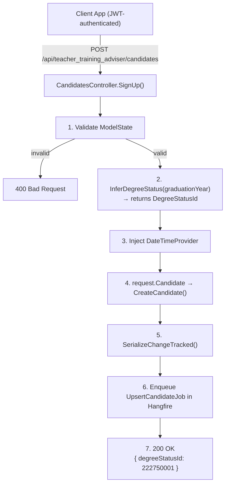
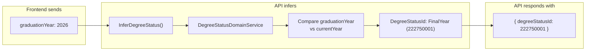

# `POST /api/teacher_training_adviser/candidates` — `SignUp()`

**File:** `Controllers/TeacherTrainingAdviser/CandidatesController.cs`
**Method:** `SignUp()` (line 62)

Signs up a candidate for the Teacher Training Adviser service. Accepts a detailed form with degree information, GCSE status, and optional callback scheduling. Infers degree status from graduation year, serializes as change-tracked JSON, enqueues a Hangfire background job, and returns `200 OK` with the inferred degree status.

---

## Request path (synchronous)

```csharp
[HttpPost]
[Route("api/teacher_training_adviser/candidates")]
[Authorize(Roles = "Admin,GetAnAdviser,Apply,GetIntoTeaching")]
public IActionResult SignUp(TeacherTrainingAdviserSignUp request)
{
    if (!ModelState.IsValid)
        return BadRequest(this.ModelState);

    int? degreeStatusId = request.InferDegreeStatus(
        _degreeStatusDomainService, _currentYearProvider);

    request.DateTimeProvider = _dateTime;
    string json = request.Candidate.SerializeChangeTracked();
    _jobClient.Enqueue<UpsertCandidateJob>((x) => x.Run(json, null));

    return Ok(new DegreeStatusResponse { DegreeStatusId = degreeStatusId });
}
```

**There are zero CRM calls on the request path.** All CRM work happens later in the Hangfire job.

### Step-by-step



| # | Code | What happens |
|---|------|-------------|
| 1 | `ModelState.IsValid` | Validates the request body against `TeacherTrainingAdviserSignUpValidator` — a complex FluentValidation validator with ~35 rules (see Validator section). Returns `400 Bad Request` with error details if invalid. |
| 2 | `request.InferDegreeStatus(...)` | If the request includes a `graduationYear`, compares it against the current year and infers the candidate's degree status (e.g. "First Year", "Final Year", "Has Degree"). Returns the inferred `DegreeStatusId` (see Degree Status Inference section). |
| 3 | `request.DateTimeProvider = _dateTime` | Injects `IDateTimeProvider` into the DTO so contract tests can freeze time for timestamp assertions. |
| 4 | `request.Candidate` | A `[JsonIgnore]` computed property that calls `CreateCandidate()` — builds a full `Candidate` CRM entity from the flat DTO fields. This is the most complex DTO construction in the app, performing ~15 steps (see CreateCandidate section). |
| 5 | `.SerializeChangeTracked()` | Serializes only non-null properties into compact camelCase JSON. |
| 6 | `_jobClient.Enqueue<UpsertCandidateJob>(...)` | Enqueues the same Hangfire job used by all other candidate endpoints (see CallbacksController.md for job internals). |
| 7 | `return Ok(...)` | Returns `200 OK` with `{ degreeStatusId: <inferred value> }`. Unlike `Book()` which returns `204`, this returns the inferred degree status so the frontend can display/use it. |

---

## Request body (`TeacherTrainingAdviserSignUp`)

**File:** `Models/TeacherTrainingAdviser/TeacherTrainingAdviserSignUp.cs`

| Field | Type | Required | WriteOnly | Mapped to | Description |
|-------|------|----------|-----------|-----------|-------------|
| `candidateId` | `Guid?` | No | | `Candidate.Id` | Existing candidate GUID (null for new) |
| `qualificationId` | `Guid?` | No | | `Candidate.Qualification[].Id` | Existing qualification GUID |
| `subjectTaughtId` | `Guid?` | No | | `Candidate.PastTeachingPosition[].SubjectTaughtId` | | |
| `pastTeachingPositionId` | `Guid?` | No | | `Candidate.PastTeachingPosition[].Id` | |
| `preferredTeachingSubjectId` | `Guid?` | Conditional | | `Candidate.PreferredTeachingSubjectId` | Required when phase is Secondary |
| `countryId` | `Guid?` | **Yes** | | `Candidate.CountryId` | |
| `acceptedPolicyId` | `Guid?` | **Yes** | Yes | `CandidatePrivayPolicy.AcceptedPolicyId` | |
| `degreeCountry` | `Guid?` | No | | `Candidate.Qualification[].DegreeCountry` | Must be valid degree country if set |
| `typeId` | `int?` | **Yes** | | `Candidate.TypeId` | Candidate type (ReturningToTeacherTraining / InterestedInTeacherTraining) |
| `ukDegreeGradeId` | `int?` | Conditional | | `Candidate.Qualification[].UkDegreeGradeId` | Required when degree + HasDegree; must be FirstClass/UpperSecond/LowerSecond/NotApplicable |
| `degreeTypeId` | `int?` | Conditional | | `Candidate.Qualification[].TypeId` | Required for new teachers; must be Degree or DegreeEquivalent when HasDegree |
| `degreeStatusId` | `int?` | Conditional | | `Candidate.Qualification[].DegreeStatusId` | Must NOT be NoDegree for new teachers; can be inferred from graduationYear |
| `initialTeacherTrainingYearId` | `int?` | Conditional | | `Candidate.InitialTeacherTrainingYearId` | Required for new teachers with HasDegree (unless degree country is "AnotherCountry") |
| `stageTaughtId` | `int?` | No | | `Candidate.PastTeachingPosition[].EducationPhaseId` | |
| `preferredEducationPhaseId` | `int?` | Conditional | | `Candidate.PreferredEducationPhaseId` | Required for new teachers with HasDegree (unless degree country is "AnotherCountry") |
| `hasGcseMathsAndEnglishId` | `int?` | No | | `Candidate.HasGcseMathsId`, `Candidate.HasGcseEnglishId` | `HasOrIsPlanningOnRetaking` value |
| `hasGcseScienceId` | `int?` | No | | `Candidate.HasGcseScienceId` | |
| `planningToRetakeGcseMathsAndEnglishId` | `int?` | No | | `Candidate.PlanningToRetakeGcseMathsId`, `Candidate.PlanningToRetakeGcseEnglishId` | |
| `planningToRetakeGcseScienceId` | `int?` | No | | `Candidate.PlanningToRetakeGcseScienceId` | |
| `adviserStatusId` | `int?` | No | | `Candidate.AdviserStatusId` | |
| `channelId` | `int?` | No | Yes | `Candidate.ChannelId` | Legacy channel field (deprecated) |
| `creationChannelSourceId` | `int?` | No | Yes | `ContactChannelCreation.SourceId` | Override channel source |
| `creationChannelServiceId` | `int?` | No | Yes | `ContactChannelCreation.ServiceId` | Override channel service |
| `creationChannelActivityId` | `int?` | No | Yes | `ContactChannelCreation.ActivityId` | Override channel activity |
| `email` | `string` | **Yes** | | `Candidate.Email` | |
| `firstName` | `string` | **Yes** | | `Candidate.FirstName` | |
| `lastName` | `string` | **Yes** | | `Candidate.LastName` | |
| `dateOfBirth` | `DateTime?` | **Yes** | | `Candidate.DateOfBirth` | |
| `teacherId` | `string` | No | | `Candidate.TeacherId` | TRN (Teacher Reference Number) |
| `degreeSubject` | `string` | Conditional | | `Candidate.Qualification[].DegreeSubject` | Required unless degreeTypeId == DegreeEquivalent |
| `addressTelephone` | `string` | Conditional | | `Candidate.AddressTelephone` | Required if phoneCallScheduledAt is set |
| `addressPostcode` | `string` | Conditional | | `Candidate.AddressPostcode` | Required for UK candidates unless degree country is "AnotherCountry" |
| `phoneCallScheduledAt` | `DateTime?` | Conditional | Yes | `Candidate.PhoneCall.ScheduledAt` | Can only be set when degreeTypeId == DegreeEquivalent; must be future |
| `talkingPoints` | `string` | No | | `Candidate.PhoneCall.TalkingPoints` | Not present on TTA, only on callback |
| `situation` | `int?` | No | | `Candidate.Situation` | Must be valid pick list if set |
| `citizenship` | `int?` | No | | `Candidate.Citizenship` | Must be valid pick list if set |
| `visaStatus` | `int?` | No | | `Candidate.VisaStatus` | Must be valid pick list if set |
| `location` | `int?` | No | | `Candidate.Location` | Must be valid pick list if set |
| `graduationYear` | `int?` | No | | Used for degree status inference only | Not persisted directly |
| `canSubscribeToTeacherTrainingAdviser` | `bool` | ReadOnly | ReadOnly | Computed from candidate state | Auto-populated by matchback |
| `assignmentStatusId` | `int?` | ReadOnly | ReadOnly | `Candidate.AssignmentStatusId` | Auto-populated by matchback |

---

## Degree status inference

**File:** `Models/Crm/DegreeStatusInference/DegreeStatusInference.cs:44-71`

The endpoint calls `request.InferDegreeStatus(degreeStatusDomainService, currentYearProvider)` which:

1. Checks if `GraduationYear` is provided
2. If yes: creates a `DegreeStatusInferenceRequest` using the graduation year + current year
3. Calls `degreeStatusDomainService.GetInferredDegreeStatusFromGraduationYear(request)` which categorizes the candidate:

| Scenario | Inferred DegreeStatusId |
|----------|----------------------|
| Graduation year is in the past | `HasDegree` (222750000) |
| Graduation year is this year | `FinalYear` (222750001) |
| Graduation year is last year + 1 | `SecondYear` (222750002) |
| Graduation year is last year + 2 | `FirstYear` (222750003) |
| No graduation year provided | `null` |

4. Also calculates `InferredGraduationDate = August 31st of graduation year`

The inferred value is **returned in the response** so the frontend can pre-populate the degree status field. The actual value saved to CRM comes from the DTO's `DegreeStatusId` property (which may be set by the frontend directly or left null for inference).



---

## CreateCandidate() — DTO-to-CRM construction

This is the most complex `CreateCandidate()` in the app, performing approximately **15 distinct steps** when building the `Candidate` CRM entity from the flat DTO:

```mermaid
flowchart TD
    Start(["CreateCandidate()"])
    
    subgraph Step1["1. Basic fields"]
        A["Candidate{ Id, Email, FirstName, LastName,\nDateOfBirth, AddressPostcode, AddressTelephone,\nTeacherId, TypeId, InitialTeacherTrainingYearId,\nPreferredEducationPhaseId, PreferredTeachingSubjectId,\nCountryId, HasGcse*, PlanningToRetakeGcse*,\nSituation, Citizenship, VisaStatus, Location }"]
    end

    subgraph Step2["2. Hard-coded defaults"]
        B1["EligibilityRulesPassed = 'false'"]
        B2["AdviserRequirementId = null"]
        B3["AdviserEligibilityId = null"]
        B4["AssignmentStatusId = null"]
        B5["PreferredPhoneNumberTypeId = Home"]
        B6["PreferredContactMethodId = Any"]
        B7["GdprConsentId = Consent"]
        B8["OptOutOfGdpr = false"]
    end

    subgraph Step3["3. ConfigureChannel()"]
        C["Creates ContactChannelCreation\n(source=GITWebsite, service=TeacherTrainingAdviserService)"]
    end

    subgraph Step4["4. ConfigureGcseStatus()"]
        D["Any null GCSE → set to NotAnswered"]
    end

    subgraph Step5["5. AcceptPrivacyPolicy()"]
        E["If AcceptedPolicyId set:\n→ CandidatePrivacyPolicy{AcceptedAt=UtcNow}"]
    end

    subgraph Step6["6. SchedulePhoneCall()"]
        F["If PhoneCallScheduledAt set:\n→ EligibilityRulesPassed='true'\n→ PhoneCall{Telephone, ScheduledAt,\n   ChannelId=CallbackRequest}\n→ Destination = UK or International"]
    end

    subgraph Step7["7. AddQualification()"]
        G["If degree fields provided:\n→ CandidateQualification{Id, UkDegreeGradeId,\n   DegreeStatusId, DegreeSubject,\n   TypeId, DegreeCountry}"]
    end

    subgraph Step8["8. AddPastTeachingPosition()"]
        H["If returning to teaching:\n→ Set HasQualifiedTeacherStatus\n→ CandidatePastTeachingPosition{SubjectTaughtId,\n   EducationPhaseId}"]
    end

    subgraph Step9["9. SetAdviserEligibility()"]
        I["If NO phone call scheduled:\n→ AssignmentStatusId = WaitingToBeAssigned\n→ AdviserEligibilityId = Yes\n→ AdviserRequirementId = Yes\n→ StatusIsWaitingToBeAssignedAt = UtcNow"]
    end

    subgraph Step10["10. DefaultPreferredEducationPhase()"]
        J["If returning to teaching & no phase set:\n→ PreferredEducationPhaseId = Secondary"]
    end

    subgraph Step11["11. DefaultPreferredTeachingSubjectId()"]
        K["If phase is Primary:\n→ PreferredTeachingSubjectId = Primary(guid)"]
    end

    subgraph Step12["12. UpdateClosedAdviserStatus()"]
        L["If adviserStatusId is a closed reason:\n→ HasReRegistered = true"]
    end

    subgraph Step13["13. SubscribeToTeacherTrainingAdviser()"]
        M["HasTeacherTrainingAdviserSubscription = true\nChannelId = Subscribed\nStartAt = UtcNow\nBulkEmail/MM flags based on IsReturningToTeaching()"]
    end

    Start --> Step1
    Step1 --> Step2
    Step2 --> Step3
    Step3 --> Step4
    Step4 --> Step5
    Step5 --> Step6
    Step6 --> Step7
    Step7 --> Step8
    Step8 --> Step9
    Step9 --> Step10
    Step10 --> Step11
    Step11 --> Step12
    Step12 --> Step13
```



### Detailed step descriptions

#### 1. Basic fields (line 271-304)
Copies ~20 fields from the DTO to the `Candidate`:
- Identity: `Id`, `Email`, `FirstName`, `LastName`, `DateOfBirth`, `TeacherId`
- Contact: `AddressPostcode` (formatted), `AddressTelephone` (formatted with international prefix logic)
- Preferences: `PreferredTeachingSubjectId`, `CountryId`, `PreferredEducationPhaseId`, `InitialTeacherTrainingYearId`, `TypeId`
- GCSE: `HasGcseMathsId` = `HasGcseMathsAndEnglishId` (both English and Maths set from same field), `HasGcseScienceId`, `PlanningToRetakeGcseMathsId` = `PlanningToRetakeGcseMathsAndEnglishId`, `PlanningToRetakeGcseScienceId`
- Demographics: `Situation`, `Citizenship`, `VisaStatus`, `Location`

#### 2. Hard-coded defaults (line 292-303)
Sets conservative defaults for fields the frontend doesn't control:
- `EligibilityRulesPassed = "false"` — overridden to `"true"` if a phone call is scheduled
- `AdviserRequirementId = null`, `AdviserEligibilityId = null`, `AssignmentStatusId = null` — set later by `SetAdviserEligibility` if applicable
- `PreferredPhoneNumberTypeId = Home`, `PreferredContactMethodId = Any`
- `GdprConsentId = Consent`, `OptOutOfGdpr = false`

#### 3. ConfigureChannel() (line 306-308)
Same pattern as all other DTOs — creates a `ContactChannelCreation` child entity with:
- `sourceId = GITWebsite` (unless overridden)
- `serviceId = TeacherTrainingAdviserService` (different from CallbacksController which uses `MailingList`)
- Only created for new candidates (no existing ID)

#### 4. ConfigureGcseStatus() (line 309, defined at line 335)
Any GCSE field the user didn't fill in is set to `NotAnswered`:
```csharp
if (HasGcseMathsAndEnglishId == null) {
    candidate.HasGcseMathsId = (int)GcseStatus.NotAnswered;
    candidate.HasGcseEnglishId = (int)GcseStatus.NotAnswered;
}
```
Same pattern for `HasGcseScienceId`, `PlanningToRetakeGcseMathsAndEnglishId`, `PlanningToRetakeGcseScienceId`.

#### 5. AcceptPrivacyPolicy() (line 310)
If `AcceptedPolicyId` is set, creates `CandidatePrivacyPolicy` with consent metadata (identical to CallbacksController).

#### 6. SchedulePhoneCall() (line 311, defined at line 372)
If `PhoneCallScheduledAt` is set:
- `candidate.EligibilityRulesPassed = "true"` — flags the candidate as eligible for TTA service
- Creates `PhoneCall` with `ChannelId = CallbackRequest` (222750003, vs WebsiteCallbackRequest used by CallbacksController)
- Determines `DestinationId` based on `CountryId` (UK vs International)

#### 7. AddQualification() (line 312, defined at line 388)
If any degree field is present (`UkDegreeGradeId`, `DegreeStatusId`, `DegreeSubject`, or `DegreeTypeId`):
```csharp
candidate.Qualifications.Add(new CandidateQualification()
{
    Id = QualificationId,        // null for new, existing GUID for edits
    UkDegreeGradeId = UkDegreeGradeId,
    DegreeStatusId = DegreeStatusId,  // may have been inferred or set directly
    DegreeSubject = DegreeSubject,
    TypeId = DegreeTypeId,
    DegreeCountry = (Guid?)DegreeCountry,
});
```
The check `ContainsQualification()` at line 460 ensures empty qualifications are not created.

#### 8. AddPastTeachingPosition() (line 313, defined at line 404)
Only runs if `candidate.IsReturningToTeaching()`:
- Sets `HasQualifiedTeacherStatus = Yes` for returning teachers, `No` otherwise
- If primary education phase: creates `CandidatePastTeachingPosition` with `PrimaryTeachingSubjectId` and `Primary` education phase
- If secondary education phase (or null, which defaults to secondary): creates with the provided `SubjectTaughtId`

#### 9. SetAdviserEligibility() (line 314, defined at line 438)
If no phone call was scheduled (i.e. the candidate doesn't need a callback):
```csharp
candidate.AssignmentStatusId = (int)AssignmentStatus.WaitingToBeAssigned;
candidate.AdviserEligibilityId = (int)AdviserEligibility.Yes;
candidate.AdviserRequirementId = (int)AdviserRequirement.Yes;
candidate.StatusIsWaitingToBeAssignedAt = DateTimeProvider.UtcNow;
```
This marks the candidate as ready for automatic adviser allocation.

#### 10. DefaultPreferredEducationPhase() (line 315, defined at line 198)
```csharp
if (candidate.IsReturningToTeaching() && candidate.PreferredEducationPhaseId == null)
    candidate.PreferredEducationPhaseId = (int)Candidate.PreferredEducationPhase.Secondary;
```
Returning teachers default to Secondary if they didn't specify a phase.

#### 11. DefaultPreferredTeachingSubjectId() (line 316, defined at line 206)
```csharp
if (candidate.PreferredEducationPhaseId == (int)Candidate.PreferredEducationPhase.Primary)
    candidate.PreferredTeachingSubjectId = TeachingSubject.PrimaryTeachingSubjectId;
```
If the phase is Primary, clears any subject selection and uses the Primary subject GUID.

#### 12. UpdateClosedAdviserStatus() (line 317, defined at line 324)
```csharp
if (AdviserStatusId != null && Enum.IsDefined(typeof(ResubscribableAdviserStatus), AdviserStatusId))
    candidate.HasReRegistered = true;
```
If the candidate previously had a "closed" adviser status (e.g. "No Longer Pursuing Teaching", "Already Has QTS"), marks them for re-registration so the `CandidateUpserter` can execute the `dfe_ReRegisterCandidate` CRM action.

#### 13. SubscribeToTeacherTrainingAdviser() (line 319, defined in `SubscriptionManager.cs:55`)
Sets all subscription metadata:
```csharp
candidate.HasTeacherTrainingAdviserSubscription = true;
candidate.TeacherTrainingAdviserSubscriptionChannelId = (int)SubscriptionChannel.Subscribed;
candidate.TeacherTrainingAdviserSubscriptionStartAt = utcNow;
candidate.TeacherTrainingAdviserSubscriptionDoNotBulkEmail = candidate.IsReturningToTeaching();
candidate.TeacherTrainingAdviserSubscriptionDoNotSendMm = candidate.IsReturningToTeaching();
```
Returning teachers get bulk email/MM opt-outs set to `true` (since they're already in the system).

---

## Validation rules

**File:** `Models/TeacherTrainingAdviser/Validators/TeacherTrainingAdviserSignUpValidator.cs`

The validator has ~35 rules organized into conditional groups:

### Always-required fields
| Field | Rule |
|-------|------|
| `firstName` | `.NotNull()` |
| `lastName` | `.NotNull()` |
| `email` | `.NotNull()` |
| `dateOfBirth` | `.NotNull()` |
| `acceptedPolicyId` | `.NotNull()` |
| `countryId` | `.NotNull()` |
| `typeId` | `.NotNull()` |

### Conditional requirements

| Condition | Rule |
|-----------|------|
| `phoneCallScheduledAt` is set | `addressTelephone` must be `.NotNull()` |
| `phoneCallScheduledAt` is set | Must be `.GreaterThan(UtcNow)` |
| `degreeTypeId` is NOT `DegreeEquivalent` | `phoneCallScheduledAt` must be `.Null()` |
| Country is UK AND degree country is NOT "AnotherCountry" | `addressPostcode` must be `.NotNull()` |

### Returning to teaching rules (`TypeId == ReturningToTeacherTraining`)
| Condition | Rule |
|-----------|------|
| `PreferredEducationPhaseId == Secondary` | `preferredTeachingSubjectId` must be `.NotNull()` |
| `PreferredEducationPhaseId == null` (defaults to Secondary) | `preferredTeachingSubjectId` must be `.NotNull()` |
| `StageTaughtId == null` (defaults to Secondary) | `subjectTaughtId` must be `.NotNull()` |
| `StageTaughtId == Secondary` | `subjectTaughtId` must be `.NotNull()` |

### Interested in teaching rules (`TypeId == InterestedInTeacherTraining`)
| Condition | Rule |
|-----------|------|
| `degreeStatusId == HasDegree` AND degree country is NOT "AnotherCountry" | `preferredEducationPhaseId` must be `.NotNull()` |
| Always | `degreeTypeId` must be `.NotNull()` |
| Always | `degreeStatusId` must NOT be `NoDegree` |
| `preferredEducationPhaseId == Secondary` | `preferredTeachingSubjectId` must be `.NotNull()` |
| `degreeStatusId == HasDegree` AND degree country is NOT "AnotherCountry" | `initialTeacherTrainingYearId` must be `.NotNull()` |
| `degreeStatusId == HasDegree` | `degreeTypeId` must be `Degree` or `DegreeEquivalent` |
| `degreeStatusId` is studying (FirstYear/SecondYear/FinalYear/Other) | `degreeTypeId` must be `Degree` |
| `degreeTypeId` is NOT `DegreeEquivalent` | `degreeSubject` must be `.NotNull()` |
| `degreeTypeId == Degree` AND `degreeStatusId == HasDegree` AND `preferredEducationPhaseId` is set | Must have `HasGcseMathsAndEnglishId` or `PlanningToRetakeGcseMathsAndEnglishId` set to `HasOrIsPlanningOnRetaking` |
| `degreeTypeId == Degree` AND `degreeStatusId == HasDegree` | `ukDegreeGradeId` must be `.NotNull()` |

### Value validation
| Field | Validator |
|-------|-----------|
| `situation` | Must be a valid pick list item for `contact.dfe_situation` (if set) |
| `citizenship` | Must be a valid pick list item for `contact.dfe_citizenship` (if set) |
| `visaStatus` | Must be a valid pick list item for `contact.dfe_visastatus` (if set) |
| `location` | Must be a valid pick list item for `contact.dfe_location` (if set) |
| `degreeCountry` | Must be in `Country.DegreeCountriesList` (if set) |
| `ukDegreeGradeId` | Must be a valid pick list item for `dfe_candidatequalification.dfe_ukdegreegrade`, and must be one of: `FirstClass`, `UpperSecond`, `LowerSecond`, `NotApplicable` (if set) |

---

## PopulateWithCandidate() — reverse population (ExchangeAccessToken/Matchback)

When an existing candidate is found via `ExchangeAccessToken` or `Matchback`, the DTO is populated from the CRM candidate:

```csharp
private void PopulateWithCandidate(Candidate candidate)
{
    CandidateId = candidate.Id;
    PreferredTeachingSubjectId = candidate.PreferredTeachingSubjectId;
    CountryId = candidate.CountryId;
    // ... (basic fields)
    
    CanSubscribeToTeacherTrainingAdviser = CanSubscribe(candidate);
    
    var latestQualification = candidate.Qualifications
        .OrderByDescending(q => q.CreatedAt).FirstOrDefault();
    if (latestQualification != null)
    {
        QualificationId = latestQualification.Id;
        DegreeSubject = latestQualification.DegreeSubject;
        UkDegreeGradeId = latestQualification.UkDegreeGradeId;
        DegreeStatusId = latestQualification.DegreeStatusId;  // from CRM!
        DegreeTypeId = latestQualification.TypeId;
        DegreeCountry = latestQualification.DegreeCountry;
    }
    
    var latestPastTeachingPosition = candidate.PastTeachingPositions
        .OrderByDescending(q => q.CreatedAt).FirstOrDefault();
    if (latestPastTeachingPosition != null)
    {
        PastTeachingPositionId = latestPastTeachingPosition.Id;
        SubjectTaughtId = latestPastTeachingPosition.SubjectTaughtId;
    }
}
```

The `CanSubscribeToTeacherTrainingAdviser` check:
```csharp
private static bool CanSubscribe(Candidate candidate)
{
    if (!candidate.HasTeacherTrainingAdviser())
        return true;  // never subscribed → can subscribe
    
    if (candidate.AdviserStatusId == null)
        return false; // subscribed but no status → cannot re-subscribe
    
    // Can re-subscribe only if status is a "closed" reason
    return Enum.IsDefined(typeof(ResubscribableAdviserStatus), candidate.AdviserStatusId);
}
```

---

## Complete data flow

```mermaid
flowchart TD
    subgraph Request["REQUEST PATH (synchronous)"]
        Client["Client App (JWT-authenticated)"]
        Controller["CandidatesController.SignUp()"]
        Validate["1. Validate ModelState"]
        BadRequest["400 Bad Request"]
        Infer["2. InferDegreeStatus(graduationYear)\n→ returns DegreeStatusId"]
        Inject["3. Inject DateTimeProvider"]
        Build["4. CreateCandidate()"]
        Serialize["5. SerializeChangeTracked() → JSON"]
        Enqueue["6. Enqueue UpsertCandidateJob in Hangfire"]
        Response["7. 200 OK\n{ degreeStatusId: ... }"]

        Client -->|POST /api/teacher_training_adviser/candidates| Controller
        Controller --> Validate
        Validate -->|invalid| BadRequest
        Validate -->|valid| Infer
        Infer --> Inject
        Inject --> Build

        subgraph CreateCandidate["CreateCandidate() — 15 steps"]
            Fields["1. Copy 20+ fields"]
            Defaults["2. Hard-coded defaults"]
            Channel["3. ConfigureChannel()\n(source=GITWebsite, service=TTA)"]
            Gcse["4. ConfigureGcseStatus()\n(null → NotAnswered)"]
            Policy["5. AcceptPrivacyPolicy()"]
            Phone["6. SchedulePhoneCall()\n(EligibilityRulesPassed='true')"]
            Qual["7. AddQualification()"]
            PastTeach["8. AddPastTeachingPosition()"]
            Adviser["9. SetAdviserEligibility()\n(WaitingToBeAssigned)"]
            DefaultPhase["10. DefaultPreferredEducationPhase()\n(Secondary for returning teachers)"]
            DefaultSubject["11. DefaultPreferredTeachingSubjectId()\n(Primary for primary phase)"]
            Closed["12. UpdateClosedAdviserStatus()\n(HasReRegistered=true)"]
            Subscribe["13. SubscribeToTeacherTrainingAdviser()\n(subscription metadata)"]
            
            Fields --> Defaults --> Channel --> Gcse --> Policy --> Phone
            Phone --> Qual --> PastTeach --> Adviser --> DefaultPhase
            DefaultPhase --> DefaultSubject --> Closed --> Subscribe
        end

        Build --> CreateCandidate
        Subscribe --> Serialize
        Serialize --> Enqueue
        Enqueue --> Response
    end

    subgraph Background["BACKGROUND PATH (asynchronous)"]
        HF["Hangfire worker picks up job"]
        Deser["DeserializeChangeTracked&lt;Candidate&gt;()"]
        Dedup["Deduplicate? (Redis, 5-sec TTL)"]
        Paused{"CRM integration\npaused?"}
        LastAttempt{"Last retry\nattempt?"}
        FailEmail["Send failure email\nvia GOV.UK Notify"]
        Upsert["CandidateUpserter.Upsert(candidate)"]
        Metrics["Record Prometheus metric"]

        HF --> Deser --> Dedup
        Dedup -->|duplicate| Skip["Skip"]
        Dedup -->|first time| Paused
        Paused -->|yes| Retry["Throw → Hangfire retries"]
        Paused -->|no| LastAttempt
        LastAttempt -->|yes| FailEmail
        LastAttempt -->|no| Upsert
        FailEmail --> Metrics
        Upsert --> Metrics
    end
```



---

## Response

| Status | Body | When |
|--------|------|------|
| `200 OK` | `{ "degreeStatusId": 222750001 }` | Success — request validated, degree inferred, job queued |
| `400 Bad Request` | `{ "fieldName": ["error message", ...] }` | Model validation failed |

### The `degreeStatusId` response explained

The `200 OK` response body is intentionally minimal:

```json
{
  "degreeStatusId": 222750001
}
```

This is the **inferred degree status** calculated from the `graduationYear` the frontend sent. The frontend uses this to:
- Display the inferred status to the user: "We've determined you're a Final Year student — is this correct?"
- Pre-populate the degree status dropdown in subsequent form steps
- Avoid duplicating the inference logic client-side

The possible values:

| Value | Meaning |
|-------|---------|
| `222750000` | Has Degree |
| `222750001` | Final Year |
| `222750002` | Second Year |
| `222750003` | First Year |
| `222750004` | No Degree |
| `222750005` | Other |
| `null` | No graduation year provided |

**Important:** This response value is informational only. The actual `DegreeStatusId` that gets persisted to CRM comes from the full `Candidate` object inside the Hangfire job — which includes the `DegreeStatusId` that was set on the DTO (either inferred inline, provided by the frontend, or loaded from a previous qualification).

---

## Key differences from `POST /api/get_into_teaching/callbacks`

| Aspect | Callbacks `Book()` | TTA `SignUp()` |
|--------|-------------------|----------------|
| Response | `204 No Content` | `200 OK` with `{ degreeStatusId }` |
| DTO complexity | Simple — 5 fields + 2 optional child entities | Complex — 30+ fields + multiple child entities |
| Business logic | Minimal — just field copy | Extensive — degree inference, GCSE defaults, adviser eligibility, phase/subject defaults, past teaching position logic |
| Degree inference | None | `InferDegreeStatus()` from `graduationYear` |
| Child entities | PhoneCall, PrivacyPolicy | Qualification, PastTeachingPosition, PhoneCall, PrivacyPolicy, ContactChannelCreation + subscription metadata |
| Subscription | None | `SubscribeToTeacherTrainingAdviser()` — sets subscription flags |
| Validation | 7 simple rules | ~35 conditional rules |
| Adviser assignment | None | Sets `WaitingToBeAssigned` if no callback requested |

---

## Dependencies

| Service | Purpose |
|---------|---------|
| `IDegreeStatusDomainService` | Infers degree status from graduation year |
| `ICurrentYearProvider` | Provides current year for degree inference |
| `IDateTimeProvider` | Time freezing for testability |
| `IBackgroundJobClient` | Enqueues `UpsertCandidateJob` in Hangfire |
| `ICandidateUpserter` | Orchestrates the multi-step CRM upsert (same as CallbacksController) |

---

## Auth

| Attribute | Value |
|-----------|-------|
| Controller-level | `[Authorize(Roles = "Admin,GetAnAdviser,Apply,GetIntoTeaching")]` |
| Endpoint-level | None (inherits controller) |

The caller must present a valid JWT in one of: `Admin`, `GetAnAdviser`, `Apply`, or `GetIntoTeaching`.
