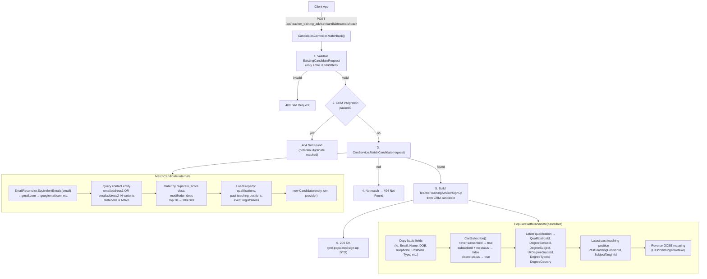

# `POST /api/teacher_training_adviser/candidates/matchback`

**File:** `Controllers/TeacherTrainingAdviser/CandidatesController.cs:127`

**Purpose:** When a returning user enters their email on the sign-up form, this endpoint checks if they already exist in CRM. If found, it returns their existing data pre-populated into the sign-up DTO so the form doesn't ask for it again. If not found (or CRM is paused), returns 404.

## Steps

| # | Code | What happens |
|---|------|-------------|
| 1 | `request.Reference ??= User.Identity.Name` | Sets reference from JWT if not provided |
| 2 | `ModelState.IsValid` | Validates email only (non-empty, valid format, max 100 chars) |
| 3 | `_appSettings.IsCrmIntegrationPaused` | Redis-backed flag; if paused returns 404 (hides candidate existence) |
| 4 | `_crm.MatchCandidate(request)` | Queries CRM: email equivalency matching on `emailaddress1`/`emailaddress2`, active candidates only, top 20 ordered by duplicate score → first match |
| 5 | `LoadCandidateRelationships(entity)` | Eagerly loads qualifications, past teaching positions, event registrations from CRM |
| 6 | `new TeacherTrainingAdviserSignUp(candidate)` | Builds pre-populated DTO via `PopulateWithCandidate()` |
| 7 | `return Ok(...)` | Returns `200 OK` with the full DTO |

## Request

| Param | Type | Required | Notes |
|-------|------|----------|-------|
| `email` | `string` | **Yes** | Validated for format + max 100 chars |
| `firstName` | `string` | No | Used for slug generation only |
| `lastName` | `string` | No | Used for slug generation only |
| `dateOfBirth` | `DateTime?` | No | Used for slug generation only |

## Response

- **`200 OK`** — Full `TeacherTrainingAdviserSignUp` JSON with candidate's existing data, including `canSubscribeToTeacherTrainingAdviser` (computed) and `assignmentStatusId` (from CRM)
- **`400 Bad Request`** — Invalid email
- **`404 Not Found`** — No match found, or CRM integration is paused

## Key details

- **Email matching** uses `equivalent_email_hosts.yml` — treat `gmail.com` and `googlemail.com` as the same mailbox. This avoids duplicate sign-ups from email variant confusion.
- **Only the latest qualification** (by `CreatedAt`) and **latest past teaching position** are returned. If a candidate has multiple degrees, only the most recent one is pre-populated.
- The `DegreeStatusId` in the response comes **from CRM** (the candidate's actual stored value), not from the `graduationYear` inference used in the `SignUp` endpoint.
- `CanSubscribeToTeacherTrainingAdviser` logic: `true` if never subscribed OR if their `AdviserStatusId` is a "closed reason" (e.g. NoLongerPursuingTeaching) meaning they can re-register.
