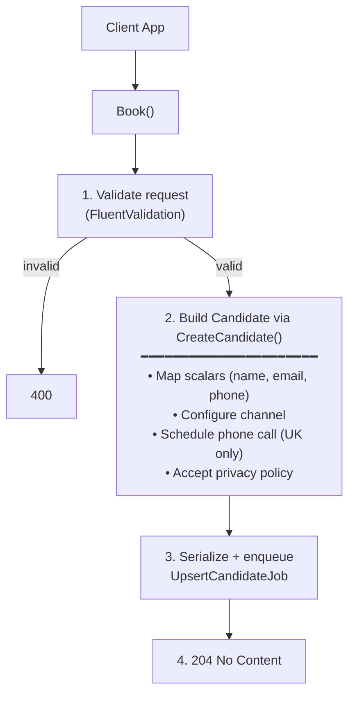

## POST `/api/get_into_teaching/callbacks`

Please check existing code and swagger doc for reference. There might be mistakes or things that I've missed here.
https://getintoteachingapi-test.test.teacherservices.cloud/swagger/index.html

**File:** `Controllers/GetIntoTeaching/CallbacksController.cs:38`

Schedules a callback (phone call) for a candidate. Validates the request, builds a `Candidate` with minimal business logic (phone call + privacy policy), serializes with change tracking, and enqueues an `UpsertCandidateJob` to persist to CRM. Returns `204 No Content` — CRM upsert is async.

## What it does (step by step)

1. Validates the request (ModelState via FluentValidation `GetIntoTeachingCallbackValidator`) — returns `400` with serialized errors if invalid
2. Constructs a `Candidate` via `request.Candidate` (calls `CreateCandidate()`):
   - **Maps scalar fields**: candidate ID, email, first name, last name, address telephone
   - **Configures channel** via `ConfigureChannel()`: sets `ChannelId` (GetIntoTeachingCallback when `DISABLE_DEFAULT_CREATION_CHANNELS=1` and candidate is new), or creates `ContactChannelCreation` entries with `CreationChannelSourceId` (GIT Website), `CreationChannelServiceId` (Mailing List), `CreationChannelActivityId` (null)
   - **Schedules phone call** (if `PhoneCallScheduledAt` is set):
     - Creates a `PhoneCall` with destination **hardcoded to UK**, channel `WebsiteCallbackRequest`, subject including full name, and `TalkingPoints`
   - **Accepts privacy policy**: if `AcceptedPolicyId` is set, creates a `CandidatePrivacyPolicy` with the accepted policy ID and current timestamp
3. Serializes the constructed candidate with change tracking (`SerializeChangeTracked`)
4. Enqueues `UpsertCandidateJob.Run(json, null)` via Hangfire (async CRM upsert)
5. Returns `204 No Content`

## Request

```json
{
  "candidateId": null,
  "email": "jane.doe@example.com",
  "firstName": "Jane",
  "lastName": "Doe",
  "addressTelephone": "07123456789",
  "phoneCallScheduledAt": "2026-06-20T14:30:00Z",
  "talkingPoints": "I want to know more about teaching Maths",
  "acceptedPolicyId": "3fa85f64-5717-4562-b3fc-2c963f66afa6"
}
```

### Field details

| Param | Type | Required | Notes |
|-------|------|----------|-------|
| `email` | `string` | **Yes** | Validated for format + max 100 chars |
| `firstName` | `string` | **Yes** | Non-empty |
| `lastName` | `string` | **Yes** | Non-empty |
| `addressTelephone` | `string` | **Yes** | Validated 5-25 chars, no alpha chars |
| `phoneCallScheduledAt` | `DateTime` | **Yes** | Must be in the future |
| `talkingPoints` | `string` | **Yes** | Non-empty — what the candidate wants to discuss |
| `acceptedPolicyId` | `Guid` | **Yes** | |
| `candidateId` | `Guid` | No | Set for existing candidates (matchback/exchange) — null for new callbacks |
| `creationChannelSourceId` | `int` | No | Overrides default GIT Website source |
| `creationChannelServiceId` | `int` | No | Overrides default Mailing List service |
| `creationChannelActivityId` | `int` | No | Overrides default null activity |

## Responses

### `204 No Content` — callback queued for upsert

No body.

### `400 Bad Request` — validation failed. This is a new proposed error format

```json
{
    "errors": [
        {
            "error": "BadRequest",
            "message": "Email is not a valid email address"
        }
    ]
}
```

## What happens next (async job)

The `UpsertCandidateJob` runs asynchronously (same job as all other upsert endpoints):

1. **Deduplication**: if a job with the same signature (`candidate.Id + Email + changed properties`) is already queued, the duplicate is silently dropped
2. **CRM pause check**: throws `InvalidOperationException` if CRM integration is paused (Hangfire retry will fire)
3. **Upsert**: calls `ICandidateUpserter.Upsert(candidate)` to persist the candidate, phone call, privacy policy, and contact channel creation to CRM
4. **Retry & failure**: on repeated failure, after all retries exhausted, sends a failure notification email via GOV.UK Notify (`CandidateRegistrationFailedEmailTemplateId`)

## Flow



## Rate limiting

| Scope | Endpoint | Period | Limit |
|-------|----------|--------|-------|
| Global (IpRateLimiting) | `POST:/api/get_into_teaching/callbacks` | 1m | 60 |
| GIT client | `POST:/api/get_into_teaching/callbacks` | 1m | 250 |
