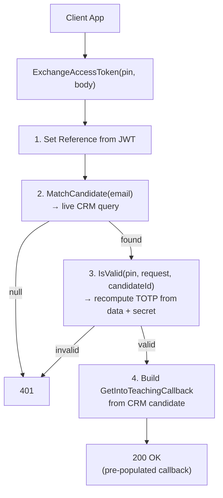

## POST `/api/get_into_teaching/callbacks/exchange_access_token/{accessToken}`

Please check existing code and swagger doc for reference. There might be mistakes or things that I've missed here.
https://getintoteachingapi-test.test.teacherservices.cloud/swagger/index.html

**File:** `Controllers/GetIntoTeaching/CallbacksController.cs:63`

Second step of the two-step email verification flow for Get Into Teaching callbacks. The user proves they own the email by providing the 6-digit PIN they received from `POST /api/candidates/access_tokens`. If valid, returns their existing CRM data pre-populated into a `GetIntoTeachingCallback`.

## What it does (step by step)

1. Sets `request.Reference` to `User.Identity.Name` (JWT client ID) if not already set
2. Calls `_crm.MatchCandidate(request)` — live CRM query by email (`Services/CrmService.cs:161`)
   - Generates equivalent email variants via `EmailReconciler` (gmail.com ↔ googlemail.com)
   - Searches `emailaddress1` and `emailaddress2` for any variant
   - Filters to active (`statecode = Active`) candidates only
   - Orders by `dfe_duplicatescorecalculated` descending, then `modifiedon` descending
   - Takes the top match
   - Loads related data: qualifications, past teaching positions, event registrations
3. Calls `_tokenService.IsValid(accessToken, request, candidateId)` — recomputes the TOTP from `Slugify(request)` + server `TOTP_SECRET_KEY` via OtpNet (`Services/CandidateAccessTokenService.cs:37-60`). Valid for ~15 minutes
4. If candidate not found or PIN invalid → `401 Unauthorized` (same response for both cases to avoid revealing candidate existence)
5. If valid → returns `200 OK` with `new GetIntoTeachingCallback(candidate)` which calls `PopulateWithCandidate()` — populates `CandidateId`, `Email`, `FirstName`, `LastName`, `AddressTelephone` (with `StripExitCode` removing leading `00`)

## Request

```json
{
  "email": "candidate@example.com",
  "firstName": "Jane",
  "lastName": "Doe",
  "dateOfBirth": "1995-06-15",
  "reference": "ref"
}
```

| Param | Location | Type | Required | Notes |
|-------|----------|------|----------|-------|
| `accessToken` | URL path | `string` | **Yes** | The 6-digit PIN |
| `email` | body | `string` | **Yes** | Must match what was sent to `access_tokens` |
| `firstName` | body | `string` | No | Must match what was sent to `access_tokens` |
| `lastName` | body | `string` | No | Must match what was sent to `access_tokens` |
| `dateOfBirth` | body | `DateTime` | No | Must match what was sent to `access_tokens` |
| `reference` | body | `string` | No | Set from JWT if not provided; not used in TOTP |

The body fields used in TOTP computation (`email`, `firstName`, `lastName`, `dateOfBirth`) must match exactly what was sent to `POST /api/candidates/access_tokens` — if any of them differ, the PIN won't verify. `reference` is excluded from TOTP and doesn't need to match.

## Responses

### `200 OK` — PIN valid

Returns a full `GetIntoTeachingCallback` JSON with the candidate's existing CRM data pre-populated (same response shape as matchback).

```json
{
  "candidateId": "3fa85f64-5717-4562-b3fc-2c963f66afa6",
  "acceptedPolicyId": null,
  "email": "candidate@example.com",
  "firstName": "Jane",
  "lastName": "Doe",
  "addressTelephone": "123456789",
  "phoneCallScheduledAt": null,
  "talkingPoints": null,
  "creationChannelSourceId": null,
  "creationChannelServiceId": null,
  "creationChannelActivityId": null,
  "defaultContactCreationChannel": 222750043,
  "defaultCreationChannelSourceId": 222750003,
  "defaultCreationChannelServiceId": 222750007,
  "defaultCreationChannelActivityId": null
}
```

Only `CandidateId`, `Email`, `FirstName`, `LastName`, `AddressTelephone` are populated from CRM. All other fields are null or computed from `ICreateContactChannel` interface defaults.

### `401 Unauthorized` — This is a new proposed error format

```json
{
    "errors": [
        {
            "error": "BadRequest",
            "message": "You did not supply valid authentication credentials"
        }
    ]
}
```

- Unlike the `Book`(/api/get_into_teaching/callbacks) endpoint, this method does **not** validate `ModelState` — it relies on the CRM match providing a null return for invalid email lookups
- Unlike the TTA `matchback` endpoint, this endpoint does **not** check for CRM integration pause
- The returned `GetIntoTeachingCallback` is the same model used by the `Book` and `matchback` endpoints

## Flow


