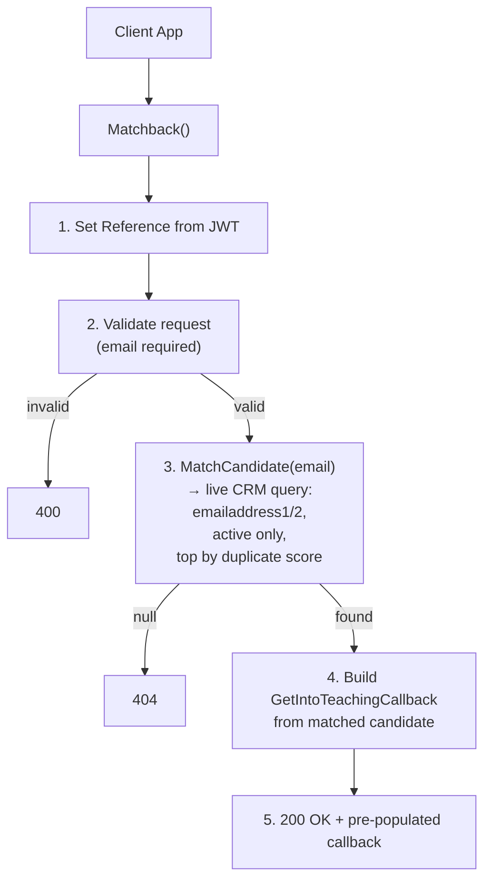

## POST `/api/get_into_teaching/callbacks/matchback`

Please check existing code and swagger doc for reference. There might be mistakes or things that I've missed here.
https://getintoteachingapi-test.test.teacherservices.cloud/swagger/index.html

**File:** `Controllers/GetIntoTeaching/CallbacksController.cs:90`

Matches a candidate by email in CRM and returns a pre-populated `GetIntoTeachingCallback` with their known data (name, phone number, candidate ID). This is a live request to the CRM. Unlike `exchange_access_token`, this endpoint requires no PIN — it matches and returns data in a single call.

## What it does (step by step)

1. Sets `request.Reference` to `User.Identity.Name` (JWT client ID) if not already set
2. Validates the request (ModelState via `ExistingCandidateRequestValidator`) — email is non-empty, valid format, max 100 chars — returns `400` if invalid
3. Calls `_crm.MatchCandidate(request)` — live CRM query (`Services/CrmService.cs:161`):
   - Generates equivalent email variants (e.g. gmail.com ↔ googlemail.com) via `EmailReconciler`
   - Searches `emailaddress1` and `emailaddress2` for any variant
   - Filters to active (`statecode = Active`) candidates only
   - Orders by `dfe_duplicatescorecalculated` descending, then `modifiedon` descending
   - Takes the top match
   - Loads related data: qualifications, past teaching positions, event registrations
4. If no candidate found — returns `404 NotFound`
5. Builds a `GetIntoTeachingCallback` from the matched candidate via `PopulateWithCandidate()` — populates `CandidateId`, `Email`, `FirstName`, `LastName`, `AddressTelephone` (with `StripExitCode` removing leading `00`)
6. Returns `200 OK` with the pre-populated callback

## Request

```json
{
  "email": "candidate@example.com",
  "firstName": "Jane",
  "lastName": "Doe",
  "dateOfBirth": "1995-06-15",
  "reference": "ref"
}
```

| Param | Type | Required | Notes |
|-------|------|----------|-------|
| `email` | `string` | **Yes** | Validated for format + max 100 chars |
| `firstName` | `string` | No | Used in matchback (may improve CRM match quality) |
| `lastName` | `string` | No | Used in matchback |
| `dateOfBirth` | `DateTime` | No | Used in matchback |
| `reference` | `string` | No | Fallback to JWT client ID if not provided; used for metrics only |

## Responses

### `200 OK` — candidate matched

Returns a full `GetIntoTeachingCallback` JSON. Only 5 fields are populated from CRM (`PopulateWithCandidate()`); the rest are null or computed defaults.

```json
{
  "candidateId": "3fa85f64-5717-4562-b3fc-2c963f66afa6",
  "acceptedPolicyId": null,
  "email": "candidate@example.com",
  "firstName": "Jane",
  "lastName": "Doe",
  "addressTelephone": "123456789",
  "phoneCallScheduledAt": null,
  "talkingPoints": null,
  "creationChannelSourceId": null,
  "creationChannelServiceId": null,
  "creationChannelActivityId": null,
  "defaultContactCreationChannel": 222750043,
  "defaultCreationChannelSourceId": 222750003,
  "defaultCreationChannelServiceId": 222750007,
  "defaultCreationChannelActivityId": null
}
```

### `400 Bad Request` — invalid email. This is a new proposed error format
```json
{
    "errors": [
        {
            "error": "BadRequest",
            "message": "Email is not a valid email address"
        }
    ]
}
```

### `404 Not Found` — candidate not found. This is a new proposed error format

```json
{
    "errors": [
        {
            "error": "NotFound",
            "message": "Candidate with #{email} not found"
        }
    ]
}
```


## Notes

- Unlike the TTA `matchback` endpoint, this endpoint does **not** check for CRM integration pause — it always queries CRM live
- No background job
- The same `GetIntoTeachingCallback` model is shared with the `Book`(/api/get_into_teaching/callbacks) and `exchange_access_token` endpoints
- The response populates only `CandidateId`, `Email`, `FirstName`, `LastName`, `AddressTelephone`. All other fields (`AcceptedPolicyId`, `PhoneCallScheduledAt`, `TalkingPoints`, `CreationChannel*`) are null. The `Default*` fields are computed from `ICreateContactChannel` interface constants.

## Flow



## Proposed changes
### Require dateOfBirth param

This endpoint has been flagged as a potential security risk because the only required param is `email`. This makes it easy to get information on candidates.

We propose to make `dateOfBirth` param required along side the `email`.
