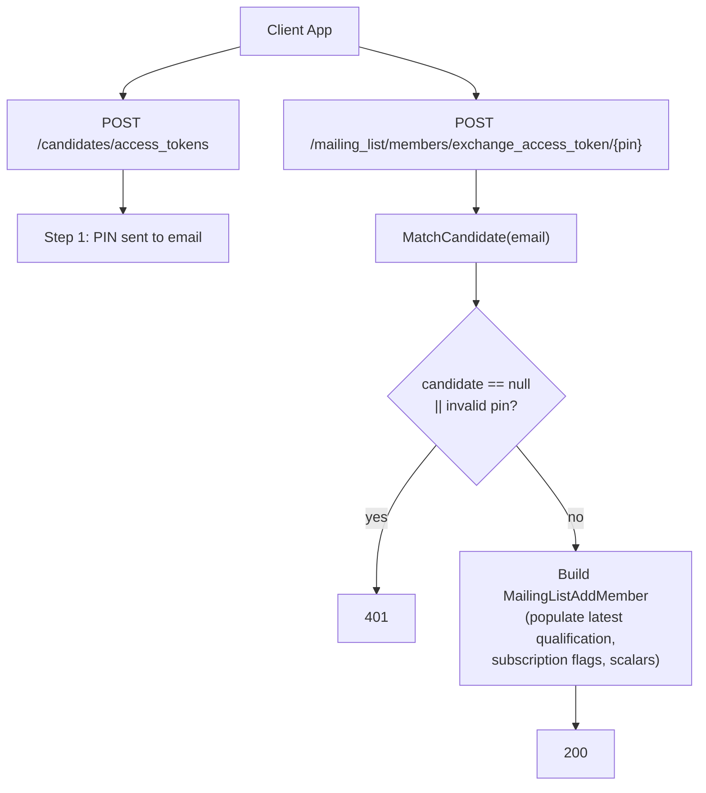

## POST `/api/mailing_list/members/exchange_access_token/{accessToken}`

Please check existing code and swagger doc for reference. I might have made mistakes or missed something here.
https://getintoteachingapi-test.test.teacherservices.cloud/swagger/index.html

**File:** `Controllers/GetIntoTeaching/MailingListController.cs:86`

Exchanges a PIN-based access token (obtained from `POST /api/candidates/access_tokens`) for a pre-populated `MailingListAddMember` for an existing candidate. This is a read operation — it does not upsert or change CRM data. The returned model can be inspected or modified and then sent to `POST /api/mailing_list/members` to finalise the subscription.


## What it does (step by step)

1. Sets `request.Reference` to `User.Identity.Name` (JWT client ID) if not already set
2. Calls `_crm.MatchCandidate(request)` — live CRM query:
   - Generates equivalent email variants (gmail.com ↔ googlemail.com)
   - Searches `emailaddress1` and `emailaddress2` for any variant
   - Filters to active (`statecode = Active`) candidates only
   - Orders by `dfe_duplicatescorecalculated` descending, then `modifiedon` descending
   - Takes the top match
3. If candidate is `null` or the access token is invalid → returns `401 Unauthorized`
4. Builds a `MailingListAddMember` from the matched candidate via `PopulateWithCandidate()`:
   - **Latest qualification**: orders qualifications by `CreatedAt` descending, maps `QualificationId` and `DegreeStatusId` from the latest
   - **Maps scalar fields**: candidate ID, preferred teaching subject, consideration journey stage, email, first name, last name, address postcode, welcome guide variant, situation
   - **Subscription read-only flags** (from CRM, not editable):
     - `AlreadySubscribedToMailingList` = `HasMailingListSubscription`
     - `AlreadySubscribedToEvents` = `HasEventsSubscription`
     - `AlreadySubscribedToTeacherTrainingAdviser` = `HasTeacherTrainingAdviser()`
5. Returns `200 OK` with the pre-populated sign-up

## Request

You must send the **exact same** `ExistingCandidateRequest` payload that was used to generate the access token in step 1.

```json
{
  "email": "jane.doe@example.com",
  "firstName": "Jane",
  "lastName": "Doe",
  "dateOfBirth": "1995-06-15",
  "reference": "ref"
}
```

### Field details

| Param | Type | Required | Notes |
|-------|------|----------|-------|
| `email` | `string` | **Yes** | Validated for format + max 100 chars |
| `firstName` | `string` | No | Used in matchback (may improve match quality) |
| `lastName` | `string` | No | Used in matchback |
| `dateOfBirth` | `DateTime` | No | Used in matchback |
| `reference` | `string` | No | Fallback to JWT client ID if not provided |

## Responses

### `200 OK` — token valid, candidate matched

Returns a pre-populated `MailingListAddMember`. Only the following fields are populated from CRM — all other fields (e.g. `graduationYear`, `citizenship`, `visaStatus`, `location`, `acceptedPolicyId`, `channelId`) will be `null`:

```json
{
  "candidateId": "3fa85f64-5717-4562-b3fc-2c963f66afa6",
  "qualificationId": "3fa85f64-5717-4562-b3fc-2c963f66afa6",
  "preferredTeachingSubjectId": "3fa85f64-5717-4562-b3fc-2c963f66afa6",
  "considerationJourneyStageId": 222750001,
  "email": "jane.doe@example.com",
  "firstName": "Jane",
  "lastName": "Doe",
  "addressPostcode": "TE5 1IN",
  "welcomeGuideVariant": "England",
  "alreadySubscribedToEvents": false,
  "alreadySubscribedToMailingList": false,
  "alreadySubscribedToTeacherTrainingAdviser": false,
  "degreeStatusId": 222750000,
  "situation": null
}
```

### `401 Unauthorized` — candidate not found or PIN invalid. New proposed error format

```json
{
    "errors": [
        {
            "error": "Unauthorized",
            "message": "Candidate not found or access token is invalid"
        }
    ]
}
```

## Flow


