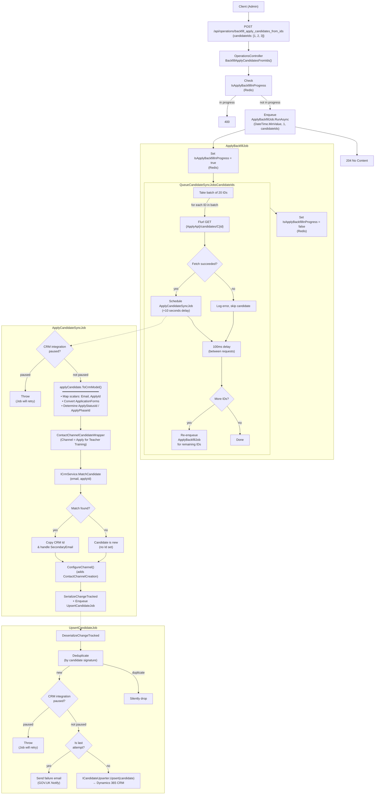

## POST `/api/operations/backfill_apply_candidates_from_ids`

Please check existing code and swagger doc for reference. I might have made mistakes or missed something here.
https://getintoteachingapi-test.test.teacherservices.cloud/swagger/index.html

**File:** `Controllers/OperationsController.cs:151`

Triggers a targeted backfill to sync specific Apply candidates into CRM. Fetches each candidate individually from the Apply API by ID, with a 100ms delay between requests to avoid overwhelming the API, and schedules individual sync jobs (delayed by 10 seconds per candidate). Processes up to 20 IDs per job invocation. Gated by the same Redis-backed lock as the updated-since variant to prevent concurrent backfills. Admin-only.

## What it does (step by step)

1. **Authorization** — requires `Admin` role
2. **Guard** — checks `IAppSettings.IsApplyBackfillInProgress` (Redis-backed flag); returns `400 Bad Request` with `"Backfill already in progress"` if a backfill is already running
3. **Enqueues backfill job** — enqueues `ApplyBackfillJob.RunAsync(DateTime.MinValue, startPage: 1, candidateIds: request.CandidateIds)` via Hangfire
4. **Returns immediately** — `204 No Content`; all work happens asynchronously in the background

### ApplyBackfillJob (`Jobs/ApplyBackfillJob.cs:47`)

1. **Sets lock** — `_appSettings.IsApplyBackfillInProgress = true` (persisted in Redis)
2. **Fetches candidates from Apply API** via `QueueCandidateSyncJobsCandidateIds(candidateIds)`:
   - Takes a batch of up to `RecordsPerJob = 20` candidate IDs
   - For each candidate ID in the batch:
     - Builds a Flurl request to `{ApplyCandidateApiUrl}/candidates/C{id}` with Bearer token auth
     - Calls `GET {ApplyApiUrl}/candidates/C{id}`
     - On success: schedules `ApplyCandidateSyncJob.Run(candidate)` with a **10-second delay** (`TimeSpan.FromSeconds(10)`)
     - On `FlurlHttpException`: logs the error (`"Failed to fetch CandidateID C{id} from the Apply API (status: {status})"`) and **silently skips** the candidate — the batch continues
     - Waits **100ms** (`Task.Delay(100)`) before the next request to avoid overwhelming the Apply API
   - **Re-enqueues self** if there are remaining IDs: enqueues another `ApplyBackfillJob.RunAsync(DateTime.MinValue, 1, remainder)` for the next batch of IDs
3. **On completion** — sets `_appSettings.IsApplyBackfillInProgress = false`

### ApplyCandidateSyncJob (`Jobs/ApplyCandidateSyncJob.cs:34`)

Runs once per candidate (triggered by the 10-second scheduled delay):

1. **CRM pause check** — if CRM integration is paused (`IAppSettings.IsCrmIntegrationPaused`), throws `InvalidOperationException`; Hangfire will retry
2. **Converts Apply → CRM model** — calls `applyCandidate.ToCrmModel()`:
   - Maps: `Email`, `ApplyId`, `ApplyCreatedAt`, `ApplyUpdatedAt`
   - Maps `ApplicationForms` via nested `ToCrmModel()` (forms → choices → references)
   - Determines `ApplyStatusId`:
     - If no application forms: sets to `NeverSignedIn` (222750000)
     - Otherwise: sets to `latestForm.StatusId` (from `application_status` → PascalCase → enum parse)
   - Determines `ApplyPhaseId`: sets to `latestForm.PhaseId` (from `application_phase` → PascalCase → enum parse)
3. **Wraps in channel** — creates `ContactChannelCandidateWrapper` with:
   - `DefaultContactCreationChannel` = `ApplyForTeacherTraining` (222750025)
   - `DefaultCreationChannelSourceId` = `Apply`
   - `DefaultCreationChannelServiceId` = `CreatedOnApply`
   - `DefaultCreationChannelActivityId` = null
   - Sets `CreationChannelSourceId = Apply`
4. **Matches against CRM** — calls `ICrmService.MatchCandidate(email, applyId)` to find existing CRM record
5. **If match found**:
   - Copies the CRM candidate `Id` onto the Apply candidate
   - If the Apply email differs from the match email **and** the match has no `SecondaryEmail` already: writes the Apply email to `SecondaryEmail` on the candidate
6. **Configures channel** — calls `candidate.ConfigureChannel(candidateId, wrappedCandidate)` which creates a `ContactChannelCreation` entity with `creationChannel: true` (if new candidate and no existing channel creations)
7. **Serializes** — `candidate.SerializeChangeTracked()` (serializes with changed property tracking)
8. **Enqueues upsert** — `_jobClient.Enqueue<UpsertCandidateJob>(x => x.Run(json, null))`

### UpsertCandidateJob (`Jobs/UpsertCandidateJob.cs:43`)

1. **Deserializes** — `json.DeserializeChangeTracked<Candidate>()`
2. **Deduplication** — if a job with the same signature (`candidate.Id + Email + changed properties`) is already queued, silently drops the duplicate
3. **CRM pause check** — throws if CRM integration is paused (Hangfire retry will fire)
4. **Last attempt handling** — on the final Hangfire retry attempt: sends a failure notification email via GOV.UK Notify (`CandidateRegistrationFailedEmailTemplateId`) and succeeds (fire-and-forget)
5. **Upsert** — calls `ICandidateUpserter.Upsert(candidate)` to persist candidate + all related entities (application forms, choices, references, contact channel creations) to Dynamics 365 CRM
6. **Metrics** — records Hangfire job queue duration for `UpsertCandidateJob`

## Request

```json
{
  "candidateIds": [1, 2, 3]
}
```

| Param | Type | Required | Notes |
|-------|------|----------|-------|
| `candidateIds` | `int[]` | **Yes** | Body param – array of Apply candidate integer IDs to backfill; each ID is prefixed with `C` when fetching from the Apply API |

## Responses

### `204 No Content` — backfill job queued

The backfill has been enqueued (or is already in progress — check is done server-side).

### `400 Bad Request` — backfill already in progress. This is a new proposed error format

```json
{
    "errors": [
        {
            "error": "BadRequest",
            "message": "Backfill already in progress"
        }
    ]
}
```

Returned when `IAppSettings.IsApplyBackfillInProgress` is `true` (Redis-backed flag).

## What happens next (async job pipeline)

The backfill triggers a chain of Hangfire jobs:

### Level 1: ApplyBackfillJob
| Aspect | Detail |
|--------|--------|
| Concurrent execution | `[DisableConcurrentExecution(3600s)]` – only one instance can run at a time |
| Retry | `[AutomaticRetry(Attempts = 0)]` – no retries; if it fails, the lock remains set |
| Records per job | `RecordsPerJob = 20` candidate IDs processed per job invocation |
| Delay between fetches | 100ms between individual Apply API requests (`Task.Delay(100)`) |
| Candidate scheduling delay | 10 seconds per candidate (`TimeSpan.FromSeconds(10)`) |
| Lock | Sets `IsApplyBackfillInProgress = true` in Redis at start, `false` at end |
| Error isolation | Individual fetch failures are caught and logged; the batch continues with remaining IDs |

### Level 2: ApplyCandidateSyncJob (per candidate)
| Aspect | Detail |
|--------|--------|
| Model conversion | Apply `Candidate.{Id, Attributes.Email, CreatedAt, UpdatedAt, ApplicationForms}` → CRM `Candidate.{Email, ApplyId, ApplyCreatedAt, ApplyUpdatedAt, ApplyStatusId, ApplyPhaseId, ApplicationForms}` |
| CRM matching | `ICrmService.MatchCandidate(email, applyId)` |
| Channel | `ContactChannelCandidateWrapper` → `DefaultContactCreationChannel = ApplyForTeacherTraining`, `CreationChannelSourceId = Apply`, `CreationChannelServiceId = CreatedOnApply` |
| Serialization | `SerializeChangeTracked()` — only changed properties are serialized for CRM upsert |

### Level 3: UpsertCandidateJob (final CRM write)
| Aspect | Detail |
|--------|--------|
| Deduplication | By signature: `{candidate.Id}-{Email}-{changed properties}` |
| CRM pause check | Throws if CRM integration is paused |
| Failure notification | On final retry, sends email via GOV.UK Notify (`CandidateRegistrationFailedEmailTemplateId`) |
| CRM upsert | Calls `ICandidateUpserter.Upsert(candidate)` — persists candidate and all nested entities to Dynamics 365 |

## Flow



## Key business rules

| Rule | Detail |
|------|--------|
| **Concurrent backfill lock** | Shares the same `IsApplyBackfillInProgress` Redis key as the updated-since variant — only one backfill (of either type) can run at a time |
| **Lock cleanup** | The lock is always set to `false` at the end of `ApplyBackfillJob.RunAsync`, even if IDs were partially processed; a new backfill can resume from where it left off via the re-enqueue mechanism |
| **Batch size** | `RecordsPerJob = 20` IDs are processed per job invocation; remaining IDs are handled by re-enqueuing the job |
| **Rate limiting** | 100ms delay (`Task.Delay(100)`) between individual Apply API requests to avoid overwhelming the service |
| **Short scheduling delay** | 10-second delay per candidate (vs 2 hours for the updated-since variant) since ID-based backfills are typically smaller and targeted |
| **Error isolation** | Individual candidate fetch failures (`FlurlHttpException`) are logged and silently skipped — the batch continues processing remaining IDs uninterrupted |
| **Email deduplication on match** | When a matching CRM record is found, the Apply candidate's email is written to `SecondaryEmail` only if it differs from the existing email **and** the match has no `SecondaryEmail` already set |
| **ApplyStatusId inference** | Candidates with no application forms get `NeverSignedIn`; otherwise the `StatusId` and `PhaseId` are derived from the latest application form's `application_status` and `application_phase` string values (converted via PascalCase → enum parse) |
| **No retry for ApplyBackfillJob** | `[AutomaticRetry(Attempts = 0)]` — the backfill job itself does not retry. If a batch fetch fails the entire job fails, but the lock remains set. Manual intervention may be needed to clear the lock |
| **Deduplication in UpsertCandidateJob** | If multiple sync jobs for the same candidate (same ID + email + changed properties) are queued, duplicates are silently dropped |
| **Last-attempt email notification** | On the final Hangfire retry of `UpsertCandidateJob`, a failure notification email is sent via GOV.UK Notify and the job succeeds (fire-and-forget) |

## Proposed changes
- Can we return 403 status code when the backfill is already taking please? Rather than 400.
- Please use the v1.4 version of the Apply api. I think this is using v1.2 right now. The v1.4 spec is here https://www.apply-for-teacher-training.service.gov.uk/candidate-api
