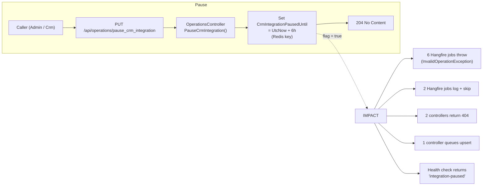

## PUT `/api/operations/pause_crm_integration`

Please check existing code and swagger doc for reference. I might have made mistakes or missed something here.
https://getintoteachingapi-test.test.teacherservices.cloud/swagger/index.html

**File:** `Controllers/OperationsController.cs:95`

Temporarily pauses the integration with the Dynamics 365 CRM. Sets a Redis-backed timestamp 6 hours in the future; all CRM-dependent operations check this flag and either abort, skip, or fall back to queuing. The pause auto-expires after 6 hours. Callable by `Admin` or `Crm` roles.

## What it does (step by step)

1. **Authorization** — requires `Admin` or `Crm` role
2. **Sets pause expiry** — `_appSettings.CrmIntegrationPausedUntil = DateTime.UtcNow.AddHours(6)` (writes ISO 8601 string to Redis key `app_settings.crm_offline_until`)
3. **Returns immediately** — `204 No Content`

## How the pause flag works

| Property | Type | Location | Detail |
|----------|------|----------|--------|
| `CrmIntegrationPausedUntil` | `DateTime?` | `AppSettings.cs:16`, backed by Redis key `app_settings.crm_offline_until` | ISO 8601 date string; `null` when not set or key missing |
| `IsCrmIntegrationPaused` | `bool` (read-only) | `AppSettings.cs:98` | Computed: `CrmIntegrationPausedUntil > DateTime.UtcNow` |
| `CrmIntegrationAutoResumeInterval` | `TimeSpan` (private) | `OperationsController.cs:24` | `TimeSpan.FromHours(6)` — the pause duration |

## Request

No body. No query parameters.

```
PUT /api/operations/pause_crm_integration
```

## Responses

### `204 No Content` — CRM integration paused

The integration is paused for 6 hours from the current server time.

## Jobs and endpoints affected by a paused CRM

When `IsCrmIntegrationPaused` is `true`, the following behaviours apply:

### Jobs that throw (Hangfire retries)

These jobs throw `InvalidOperationException` immediately. Hangfire will automatically retry them per the job's `[AutomaticRetry]` configuration.

| Job | File | Behaviour |
|-----|------|-----------|
| `ApplyCandidateSyncJob` | `Jobs/ApplyCandidateSyncJob.cs:36` | `throw new InvalidOperationException("ApplyCandidateSyncJob - Aborting (CRM integration paused).")` |
| `UpsertCandidateJob` | `Jobs/UpsertCandidateJob.cs:54` | `throw new InvalidOperationException("UpsertCandidateJob - Aborting (CRM integration paused).")` |
| `UpsertApplicationFormJob` | `Jobs/UpsertApplicationFormJob.cs:44` | `throw new InvalidOperationException("UpsertApplicationFormJob - Aborting (CRM integration paused).")` |
| `UpsertModelWithCandidateIdJob` | `Jobs/UpsertModelWithCandidateIdJob.cs:63` | `throw new InvalidOperationException("UpsertModelJob<{TypeName}> - Aborting (CRM integration paused).")` |
| `UpsertContactCreationChannelsJob` | `Jobs/UpsertContactCreationChannelsJob.cs:51` | `throw new InvalidOperationException("UpsertContactCreationChannelsJob - Aborting (CRM integration paused).")` |
| `ClaimCallbackBookingSlotJob` | `Jobs/ClaimCallbackBookingSlotJob.cs:38` | `throw new InvalidOperationException("ClaimCallbackBookingSlotJob - Aborting (CRM integration paused).")` |

### Jobs that silently skip (graceful no-op)

These jobs log a message and return immediately. They do not retry and do not throw.

| Job | File | Behaviour |
|-----|------|-----------|
| `CrmSyncJob` | `Jobs/CrmSyncJob.cs:36` | `LogInformation("CrmSyncJob - Skipping (CRM integration paused)"); return;` |
| `MagicLinkTokenGenerationJob` | `Jobs/MagicLinkTokenGenerationJob.cs:44` | `LogInformation("MagicLinkTokenGenerationJob - Skipping (CRM integration paused)"); return;` |

### Controllers that return 404 (soft miss)

These endpoints return `404 NotFound` when the CRM is paused, as if no matching candidate was found. This prevents callers from distinguishing a paused CRM from a genuine miss.

| Controller | Endpoint | File | Behaviour |
|------------|----------|------|-----------|
| `CandidatesController` | `POST /api/candidates/access_tokens` | `Controllers/CandidatesController.cs:61` | `LogInformation("CandidatesController - potential duplicate (CRM integration paused)"); return NotFound();` |
| `TeacherTrainingAdviser.CandidatesController` | `POST /api/teacher_training_adviser/candidates/matchback` | `Controllers/TeacherTrainingAdviser/CandidatesController.cs:136` | `LogInformation("TeacherTrainingAdviser - CandidatesController - potential duplicate (CRM integration paused)"); return NotFound();` |

### Controllers that fall back to queuing

This endpoint queues the upsert as a Hangfire job instead of calling the CRM synchronously. The queued `UpsertCandidateJob` will then abort with a retryable exception when the CRM is still paused.

| Controller | Endpoint | File | Behaviour |
|------------|----------|------|-----------|
| `SchoolsExperience.CandidatesController` | `POST /api/schools_experience/candidates` | `Controllers/SchoolsExperience/CandidatesController.cs:69` | `QueueUpsert(candidate);` (falls through to return `201 Created`) |

### Health check

| Service | File | Behaviour |
|---------|------|-----------|
| `CrmService.CheckStatus()` | `Services/CrmService.cs:48` | Returns `"integration-paused"` string |

## Flow



## Key business rules

| Rule | Detail |
|------|--------|
| **Auto-expiry** | The pause auto-expires after 6 hours (`CrmIntegrationAutoResumeInterval`). The API does not need manual intervention to recover from a paused state |
| **Different pause behaviours** | Some Hangfire jobs throw (retrying later), some skip silently (no retry), some controllers return 404, and one controller queues the work as a Hangfire job instead |
| **Time-based expiry** | The `IsCrmIntegrationPaused` getter compares the stored timestamp against `DateTime.UtcNow` — once the timestamp is in the past, the pause is automatically considered inactive |
| **Redis-backed** | The pause state survives application restarts as it is stored in Redis, not in-memory |
| **Admin or Crm role** | Both roles can pause — the CRM system itself can self-pause before maintenance |
