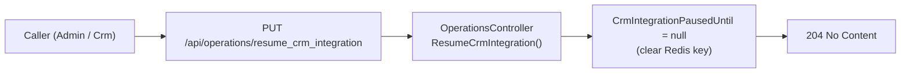

## PUT `/api/operations/resume_crm_integration`

Please check existing code and swagger doc for reference. I might have made mistakes or missed something here.
https://getintoteachingapi-test.test.teacherservices.cloud/swagger/index.html

**File:** `Controllers/OperationsController.cs:113`

Immediately resumes the integration with the Dynamics 365 CRM by clearing the Redis-backed pause timestamp. Once cleared, the `IsCrmIntegrationPaused` flag returns `false` and all CRM-dependent operations resume normal behaviour. Callable by `Admin` or `Crm` roles.

## What it does (step by step)

1. **Authorization** — requires `Admin` or `Crm` role
2. **Clears pause** — `_appSettings.CrmIntegrationPausedUntil = null` (writes a null/empty value to Redis key `app_settings.crm_offline_until`; subsequent reads of `CrmIntegrationPausedUntil` return `null`, and `IsCrmIntegrationPaused` returns `false`)
3. **Returns immediately** — `204 No Content`

## How the resume works

| Aspect | Detail |
|--------|--------|
| Setter when `null` | `AppSettings.cs:41-43` calls `_redis.Database.StringSet(key, null)` — the Redis key is overwritten with a null/empty value |
| Getter after resume | `AppSettings.cs:20-23` checks `KeyExists(CrmOfflineUntilKey)` — if the key doesn't exist or contains null/empty, returns `null` |
| `IsCrmIntegrationPaused` after resume | `AppSettings.cs:98`: `CrmIntegrationPausedUntil > DateTime.UtcNow` — since `CrmIntegrationPausedUntil` is `null`, this evaluates to `false` (a `DateTime?` comparison with a non-null value on the right side always returns `false` when the nullable is `null`) |

## Request

No body. No query parameters.

```
PUT /api/operations/resume_crm_integration
```

## Responses

### `204 No Content` — CRM integration resumed

The pause flag has been cleared. CRM operations will resume on their next check of `IsCrmIntegrationPaused`.

## Flow



## Key business rules

| Rule | Detail |
|------|--------|
| **Same auth as pause** | Requires `Admin` or `Crm` role — the same roles that can pause |
| **No side effects** | Simply clears the timestamp; does not trigger any jobs, retries, or other operations |
| **Redis-backed** | The cleared state persists immediately in Redis, surviving application restarts |
| **No error responses** | The method always returns `204`; there is no validation or guard logic |
| **Immediate effect** | The next time any job or controller checks `IsCrmIntegrationPaused`, it will read `false` |
