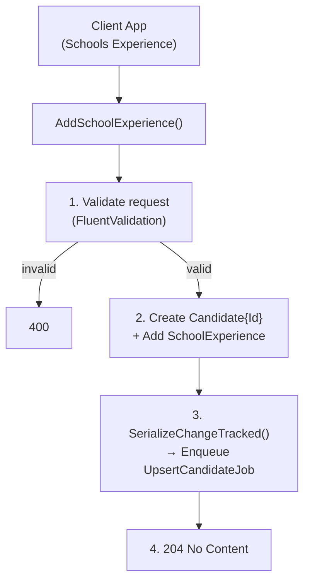

## POST `/api/schools_experience/candidates/{id}/school_experience`

Please check existing code and swagger doc for reference. There might be mistakes or things that I've missed here.
https://getintoteachingapi-test.test.teacherservices.cloud/swagger/index.html

**File:** `Controllers/SchoolsExperience/CandidatesController.cs:154`

Adds a school experience record to an existing candidate. Validates the request, serializes the candidate with change tracking, and enqueues an `UpsertCandidateJob` to persist to CRM asynchronously. Returns `204 No Content` — CRM upsert is always async.

## What it does (step by step)

1. Adds the supplied `CandidateSchoolExperience` to a `Candidate` with `Id` set to the route parameter `{id}`
2. Validates `ModelState` via FluentValidation `CandidateSchoolExperienceValidator` — returns `400` with serialized errors if invalid
3. **Serializes** the candidate with change tracking: `candidate.SerializeChangeTracked()`
   - Uses `Newtonsoft.Json` with `CamelCasePropertyNamesContractResolver` and `NullValueHandling.Ignore`
   - Only non-null properties are included in the serialized JSON
   - Includes `ChangedPropertyNames` for CRM change tracking (only changed fields are persisted)
4. **Enqueues** `UpsertCandidateJob.Run(json, null)` via Hangfire (always async, never sync)
5. Returns `204 No Content`

## Why async?

- The candidate already exists (they've already signed up)
- There's no need for an immediate response with the candidate ID
- The school experience can be persisted in the background

## Request

```json
{
  "schoolUrn": "12345678",
  "durationOfPlacementInDays": 5,
  "dateOfSchoolExperience": "2026-09-15T00:00:00Z",
  "teachingSubjectId": "3fa85f64-5717-4562-b3fc-2c963f66afa6",
  "notes": "The candidate showed great enthusiasm during their placement.",
  "schoolName": "James Brindley High School",
  "status": 1
}
```

### Route parameter

| Param | Type | Required | Notes |
|-------|------|----------|-------|
| `id` | `Guid` | **Yes** | The `candidateId` of the existing candidate |

### Body fields

| Param | Type | Required | Max length | Notes |
|-------|------|----------|------------|-------|
| `schoolUrn` | `string` | No | 8 | School URN (unique reference number) |
| `durationOfPlacementInDays` | `int` | No | ≤ 100 | Length of placement in days |
| `dateOfSchoolExperience` | `DateTime` | No | | Date of the school experience |
| `teachingSubjectId` | `Guid` | No | | Must be a valid teaching subject ID (validated against store) |
| `notes` | `string` | No | 2000 | Free-text notes about the experience |
| `schoolName` | `string` | No | 100 | Name of the school |
| `status` | `int` | No | | Defaults to `Requested` (1). See status enum below |

### School experience status

| Value | Name | Notes |
|-------|------|-------|
| `1` | `Requested` | Default status — set by CRM if not provided |
| `222750000` | `Confirmed` | |
| `222750001` | `DidNotAttend` | |
| `222750002` | `Rejected` | |
| `222750003` | `CancelledBySchool` | |
| `222750004` | `CancelledByCandidate` | |
| `222750005` | `Completed` | |
| `222750006` | `Withdrawn` | |

## Responses

### `204 No Content` — school experience queued for upsert

No body. The `UpsertCandidateJob` will handle the CRM upsert asynchronously.

### `400 Bad Request` — invalid email. New proposed error format

```json
{
    "errors": [
        {
            "error": "BadRequest",
            "message": "Teaching Subject Id must be a valid teaching subject id."
        }
    ]
}
```

### Validation rules (`CandidateSchoolExperienceValidator`)

| Field | Rule |
|-------|------|
| `SchoolUrn` | Maximum length of 8 characters |
| `DurationOfPlacementInDays` | Must be ≤ 100 |
| `TeachingSubjectId` | Must be a valid teaching subject ID (looked up from store) |
| `Notes` | Maximum length of 2000 characters |
| `SchoolName` | Maximum length of 100 characters |

All fields are optional — there are no **required** fields.

## What happens next (async job)

The `UpsertCandidateJob` runs asynchronously:

1. **Deserializes** the JSON back to a `Candidate` with the single `SchoolExperience`
2. **Deduplication**: if a job with the same signature (`candidate.Id + Email + ChangedPropertyNames`) is already queued, the duplicate is silently dropped
3. **CRM pause check**: throws `InvalidOperationException` if CRM integration is paused (Hangfire retry will fire)
4. **Upsert**: calls `ICandidateUpserter.Upsert(candidate)` which persists the `CandidateSchoolExperience` as a related entity (`dfe_candidateschoolexperience`) linked to the candidate
5. **Retry & failure**: on repeated failure, after all retries exhausted, sends a failure notification email via GOV.UK Notify (`CandidateRegistrationFailedEmailTemplateId`)

### Serialization details

The serialized JSON payload sent to the job is compact (`NullValueHandling.Ignore`):

```json
{
  "id": "3fa85f64-5717-4562-b3fc-2c963f66afa6",
  "schoolExperiences": [
    {
      "schoolUrn": "12345678",
      "durationOfPlacementInDays": 5,
      "teachingSubjectId": "3fa85f64-5717-4562-b3fc-2c963f66afa6",
      "notes": "The candidate showed great enthusiasm during their placement.",
      "schoolName": "James Brindley High School"
    }
  ],
  "changedPropertyNames": [
    "Id",
    "SchoolExperiences"
  ]
}
```

Note: `NullValueHandling.Ignore` means properties with null/empty values are excluded from the JSON. `ChangedPropertyNames` tracks which fields to update in CRM.

## Flow



## Proposed changes
- Make the schoolUrn a required param.
