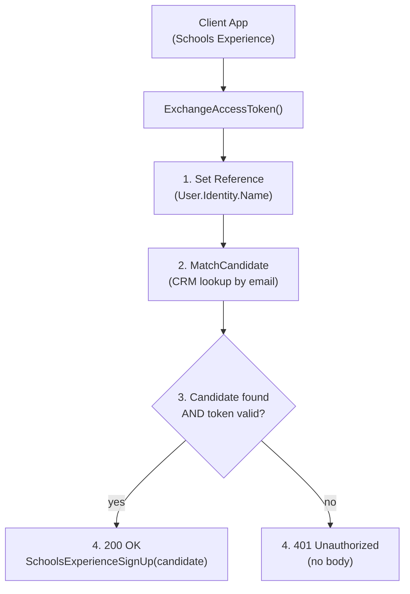

## POST `/api/schools_experience/candidates/exchange_access_token/{accessToken}`

Please check existing code and swagger doc for reference. There might be mistakes or things that I've missed here.
https://getintoteachingapi-test.test.teacherservices.cloud/swagger/index.html

**File:** `Controllers/SchoolsExperience/CandidatesController.cs:127`

Retrieves a pre-populated `SchoolsExperienceSignUp` for an existing candidate, authenticated via a TOTP-based access token (PIN code). The caller must first obtain a token via `POST /api/candidates/access_tokens` using the same `ExistingCandidateRequest` payload.

## What it does (step by step)

1. Sets `request.Reference` to the authenticated user's identity name (`User.Identity.Name`) if not already provided
2. Matches an existing candidate in CRM via `_crm.MatchCandidate(request)` — looks up by `Email`, `FirstName`, `LastName`, and optionally `DateOfBirth`
3. Validates the candidate exists **AND** the TOTP token is valid:
   - Token is a 6-digit code generated from HMAC-based TOTP
   - Token verification window (~15 minutes)
   - The TOTP secret is derived from `request.Slugify()` (email + firstname + lastname + DOB) compounded with the `TotpSecretKey` environment variable
4. If candidate is **null** OR token is **invalid**: returns `401 Unauthorized` (no body)
5. If valid: returns `200 OK` with the `SchoolsExperienceSignUp` response body (pre-populated from the matched candidate)

## Request

```json
{
  "email": "jane.doe@example.com",
  "firstName": "Jane",
  "lastName": "Doe",
  "dateOfBirth": "1990-01-15",
  "reference": "ref"
}
```

### Route parameter

| Param | Type | Required | Notes |
|-------|------|----------|-------|
| `accessToken` | `string` | **Yes** | 6-digit PIN code from `POST /api/candidates/access_tokens` |

### Body fields

| Param | Type | Required | Notes |
|-------|------|----------|-------|
| `email` | `string` | **Yes** | Must be a valid email (validated by `[ApiController]` model binding) |
| `firstName` | `string` | No | Used for candidate matching |
| `lastName` | `string` | No | Used for candidate matching |
| `dateOfBirth` | `date` | No | Used for candidate matching; format `yyyy-MM-dd` |
| `reference` | `string` | No | Defaults to `User.Identity.Name` if not provided; used for metrics |

The `firstName`, `lastName`, `dateOfBirth`, and `reference` fields are not explicitly required by the validator but may affect candidate matching precision or metrics.

## Responses

### `200 OK` — candidate matched and authenticated

Body is a pre-populated `SchoolsExperienceSignUp` with fields filled from the matched candidate record:

```json
{
  "candidateId": "3fa85f64-5717-4562-b3fc-2c963f66afa6",
  "preferredTeachingSubjectId": null,
  "secondaryPreferredTeachingSubjectId": null,
  "masterId": null,
  "merged": false,
  "fullName": "Jane Doe",
  "email": "jane.doe@example.com",
  "firstName": "Jane",
  "lastName": "Doe",
  "addressLine1": "10 Downing Street",
  "addressLine2": null,
  "addressLine3": null,
  "addressCity": "London",
  "addressStateOrProvince": "London",
  "addressPostcode": "SW1A 1AA",
  "telephone": "07123456789",
  "hasDbsCertificate": true,
  "dbsCertificateIssuedAt": "2024-01-15T00:00:00Z",
  "qualificationId": null,
  "degreeStatusId": null,
  "degreeTypeId": null,
  "degreeSubject": null,
  "ukDegreeGradeId": null,
  "defaultContactCreationChannel": 222750021,
  "defaultCreationChannelSourceId": 222750013,
  "defaultCreationChannelServiceId": 222750001,
  "defaultCreationChannelActivityId": null,
  "creationChannelSourceId": null,
  "creationChannelServiceId": null,
  "creationChannelActivityId": null
}
```

See the full field reference in [`SchoolsExperienceCandidatesControllerSignUp.md`](SchoolsExperienceCandidatesControllerSignUp.md).

### `401 Unauthorized` — candidate not found or invalid token

No body. Response indicates either:
- The candidate could not be matched from the provided details
- The access token is expired, invalid, or doesn't match the request payload

### `400 Bad Request` — invalid email. New proposed error format

```json
{
    "errors": [
        {
            "error": "BadRequest",
            "message": "Email must not be empty"
        }
    ]
}
```

## Flow


