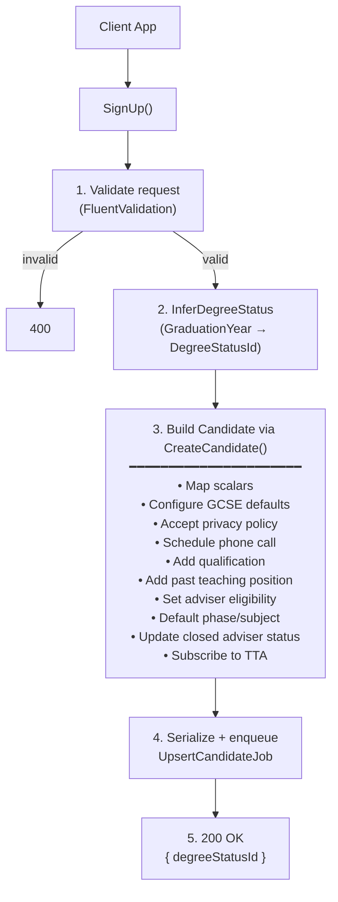

## POST `/api/teacher_training_adviser/candidates`

Please check existing code and swagger doc for reference. This is a complicated endpoint and I might have made mistakes or missed something here.
https://getintoteachingapi-test.test.teacherservices.cloud/swagger/index.html

**File:** `Controllers/TeacherTrainingAdviser/CandidatesController.cs:54`

Signs up a candidate for the Teacher Training Adviser service. Validates the request, builds a `Candidate` with extensive business logic (GCSE defaults, qualification, past teaching positions, adviser eligibility, privacy policy, phone call scheduling, subscription), infers degree status from graduation year, serializes with change tracking, and enqueues an `UpsertCandidateJob` to persist to CRM. Returns the inferred degree status immediately — CRM upsert is async.

## What it does now

1. Validates the request (ModelState via FluentValidation) — returns `400` with serialized errors if invalid
2. Infers degree status from `GraduationYear` via `request.InferDegreeStatus(degreeStatusDomainService, currentYearProvider)`:
   - If `GraduationYear` is provided: creates a `DegreeStatusInferenceRequest`, calls the domain service chain to determine `DegreeStatusId`, and sets `InferredGraduationDate` to August 31st of that year
3. Constructs a full `Candidate` via `request.Candidate` (calls `CreateCandidate()`) with the following business logic:
   - **Maps scalar fields**: candidate ID, preferred teaching subject, country, email, name, DOB, postcode (formatted via `AsFormattedPostcode`), phone (formatted via `AsFormattedTelephone` based on UK/overseas), teacher ID, type, ITT year, preferred education phase, GCSE flags, situation, citizenship, visa status, location
   - **Sets scalar defaults**: `EligibilityRulesPassed = "false"`, `PreferredPhoneNumberTypeId = Home`, `PreferredContactMethodId = Any`, `GdprConsentId = Consent`, `OptOutOfGdpr = false`; clears `AdviserRequirementId`, `AdviserEligibilityId`, `AssignmentStatusId` to null
   - **Configures channel** via `ConfigureChannel()`: sets `ChannelId` (TTA channel), `CreationChannelSourceId` (GIT Website), `CreationChannelServiceId` (Teacher Training Adviser Service) and `CreationChannelActivityId` to default values if they are not already set in the request.
   - **Configures GCSE status**: any null GCSE/retake fields default to `NotAnswered`
   - **Accepts privacy policy**: if `AcceptedPolicyId` is set, creates a `CandidatePrivacyPolicy` with the accepted policy ID and current timestamp
   - **Schedules phone call** (if `PhoneCallScheduledAt` is set):
     - Sets `EligibilityRulesPassed = "true"`
     - Creates a `PhoneCall` with destination (UK/International), channel `CallbackRequest`, subject including full name
   - **Adds qualification** (if `UkDegreeGradeId`, `DegreeStatusId`, `DegreeSubject`, or `DegreeTypeId` is provided): creates a `CandidateQualification` with `GraduationYear` set to `InferredGraduationDate`
   - **Adds past teaching position** (if returning to teaching — `TypeId == ReturningToTeacherTraining`):
     - Sets `HasQualifiedTeacherStatus = Yes`
     - If `StageTaughtId` is Primary or subject is Primary: creates position with `Primary` education phase and `PrimaryTeachingSubjectId`
     - If `StageTaughtId` is null/Secondary and subject is set: creates position with `Secondary` education phase
   - **Sets adviser eligibility** (if no phone call scheduled):
     - Sets `AssignmentStatusId = WaitingToBeAssigned`, `AdviserEligibilityId = Yes`, `AdviserRequirementId = Yes`, `StatusIsWaitingToBeAssignedAt = UtcNow`
   - **Defaults preferred education phase**: if returning to teaching and phase is null, defaults to `Secondary`
   - **Defaults preferred teaching subject**: if education phase is `Primary`, sets subject to `PrimaryTeachingSubjectId`
   - **Updates closed adviser status**: if `AdviserStatusId` is a resubscribable closed status, sets `HasReRegistered = true`
   - **Subscribes to TTA** via `SubscriptionManager.SubscribeToTeacherTrainingAdviser()`:
     - Sets `HasTeacherTrainingAdviserSubscription = true`, channel `Subscribed`, start at current time
     - `DoNotBulkEmail = true` and `DoNotSendMm = true` **if returning to teaching** (for current subscription and top-level consent; never opts out if already consented)
4. Serializes the constructed candidate with change tracking (`SerializeChangeTracked`)
5. Enqueues `UpsertCandidateJob.Run(json, null)` via Hangfire (async CRM upsert)
6. Logs `"TeacherTrainingAdviser - CandidatesController - Sign Up - {ClientId}"`
7. Returns `200 OK` with `{ "degreeStatusId": <inferred or null> }`

## Request

```json
{
  "candidateId": null,
  "email": "jane.doe@example.com",
  "firstName": "Jane",
  "lastName": "Doe",
  "dateOfBirth": "1995-06-15",
  "addressTelephone": "07123456789",
  "addressPostcode": "TE5 1IN",
  "teacherId": null,
  "typeId": 222750000,
  "ukDegreeGradeId": 222750001,
  "degreeTypeId": 222750000,
  "degreeStatusId": 222750000,
  "degreeSubject": "Mathematics",
  "initialTeacherTrainingYearId": 223360001,
  "preferredEducationPhaseId": null,
  "preferredTeachingSubjectId": null,
  "hasGcseMathsAndEnglishId": null,
  "hasGcseScienceId": null,
  "planningToRetakeGcseMathsAndEnglishId": null,
  "planningToRetakeGcseScienceId": null,
  "adviserStatusId": null,
  "channelId": null,
  "acceptedPolicyId": "3fa85f64-5717-4562-b3fc-2c963f66afa6",
  "countryId": "3fa85f64-5717-4562-b3fc-2c963f66afa6",
  "graduationYear": 2024,
  "stageTaughtId": null,
  "subjectTaughtId": null,
  "pastTeachingPositionId": null,
  "qualificationId": null,
  "phoneCallScheduledAt": null,
  "situation": null,
  "citizenship": null,
  "visaStatus": null,
  "location": null,
  "degreeCountry": null
}
```

### Field details

| Param | Type | Required | Notes |
|-------|------|----------|-------|
| `email` | `string` | **Yes** | |
| `firstName` | `string` | **Yes** | |
| `lastName` | `string` | **Yes** | |
| `dateOfBirth` | `DateTime` | **Yes** | |
| `acceptedPolicyId` | `Guid` | **Yes** | |
| `countryId` | `Guid` | **Yes** | |
| `typeId` | `int` | **Yes** | `222750000` = InterestedInTeacherTraining, `222750001` = ReturningToTeacherTraining |
| `addressTelephone` | `string` | Conditional | Required if `phoneCallScheduledAt` is set |
| `addressPostcode` | `string` | Conditional | Required if `countryId` is UK, unless `degreeCountry` is "AnotherCountry" |
| `phoneCallScheduledAt` | `DateTime` | Conditional | Must be future; only allowed when `degreeTypeId == DegreeEquivalent` |
| `degreeTypeId` | `int` | Conditional | Required for InterestedInTeacherTraining — must be `Degree` or `DegreeEquivalent` (or just `Degree` if studying) |
| `degreeStatusId` | `int` | Conditional | Cannot be `NoDegree` for InterestedInTeacherTraining |
| `ukDegreeGradeId` | `int` | Conditional | Required when `degreeStatusId == HasDegree` and `degreeTypeId == Degree`; must be one of `FirstClass`, `UpperSecond`, `LowerSecond`, `NotApplicable` |
| `degreeSubject` | `string` | Conditional | Required unless `degreeTypeId == DegreeEquivalent` |
| `initialTeacherTrainingYearId` | `int` | Conditional | Required for InterestedInTeacherTraining with a degree (unless `degreeCountry` is AnotherCountry) |
| `preferredEducationPhaseId` | `int` | Conditional | Required for InterestedInTeacherTraining with a degree (unless degree is overseas) |
| `preferredTeachingSubjectId` | `Guid` | Conditional | Required when phase is Secondary (both new and returning candidates) |
| `subjectTaughtId` | `Guid` | Conditional | Required for returning to teaching when stage taught is Secondary/null |
| `stageTaughtId` | `int` | No | Primary/Secondary — determines past teaching position education phase |
| `hasGcseMathsAndEnglishId` | `int` | Conditional | Required (along with `ukDegreeGradeId`) when has a UK degree and phase is set — must be `HasOrIsPlanningOnRetaking` |
| `planningToRetakeGcseMathsAndEnglishId` | `int` | Alternative | Accepted as alternative to `hasGcseMathsAndEnglishId` for the GCSE requirement |
| `situation` | `int` | No | Validated against CRM `dfe_situation` picklist |
| `citizenship` | `int` | No | Validated against CRM `dfe_citizenship` picklist |
| `visaStatus` | `int` | No | Validated against CRM `dfe_visastatus` picklist |
| `location` | `int` | No | Validated against CRM `dfe_location` picklist |
| `degreeCountry` | `Guid` | No | Must be in the list of valid degree countries |
| `candidateId` | `Guid` | No | Set for existing candidates (matchback/exchange) — null for new sign-ups |
| `graduationYear` | `int` | No | Used to infer `degreeStatusId` and set `inferredGraduationDate` (Aug 31st) |
| `teacherId` | `string` | No | |
| `adviserStatusId` | `int` | No | If set to a resubscribable closed status, `HasReRegistered` becomes true |
| `channelId` | `int` | No | Write-only; overrides the default TTA channel ID |

## Responses

### `200 OK` — candidate queued for upsert

```json
{
  "degreeStatusId": 222750000
}
```

`degreeStatusId` is the inferred degree status (or null if no `graduationYear` was provided).

### `400 Bad Request` — validation failed - New proposed error format

```json
{
    "errors": [
        {
            "error": "BadRequest",
            "message": "First Name must not be empty"
        }
    ]
}
```

## What happens next (async job)

The `UpsertCandidateJob` runs asynchronously:

1. **Deduplication**: if a job with the same signature (`candidate.Id + Email + changed properties`) is already queued, the duplicate is silently dropped
2. **CRM pause check**: throws if CRM integration is paused (Hangfire retry will fire)
3. **Upsert**: calls `ICandidateUpserter.Upsert(candidate)` to persist the candidate and all related entities to CRM
4. **Retry & failure**: on repeated failure, after all retries exhausted, sends a failure notification email via GOV.UK Notify (`CandidateRegistrationFailedEmailTemplateId`)

## Flow



## Rate limiting

| Scope | Endpoint | Period | Limit |
|-------|----------|--------|-------|
| Global (IpRateLimiting) | `POST:/api/teacher_training_adviser/candidates` | 1m | 60 |
| GIT client | `POST:/api/teacher_training_adviser/candidates` | 1m | 250 |
| TTA client | `POST:/api/teacher_training_adviser/candidates` | 1m | 250 |
| APPLY client | `POST:/api/teacher_training_adviser/candidates` | 1m | 250 |

## Key business rules

- **Degree status inference** maps `GraduationYear` → `DegreeStatusId` via a chain-of-responsibility domain service, inferring first/second/final year status from the graduation year.
- **Returning to teach** (`TypeId == ReturningToTeacherTraining`) vs **Interested in teaching** (`TypeId == InterestedInTeacherTraining`) gates different validation rules and defaults (adviser subscription `DoNotBulkEmail`/`DoNotSendMm` default to `true` for returning teachers)
- **Phone call** can only be scheduled for candidates with a `DegreeEquivalent` degree type — this is the only scenario where phone call scheduling is allowed
- **Consent values** (`OptOutOfSms`, `DoNotBulkEmail`, etc.) use `ConsentValue` pattern — never overwrite `false` (opted in) with `true` (opted out)

## Proposed changes

### Context

The `degreeStatusId` field has historically been set directly by clients (including Apply). However, the GIT website now sends `graduationYear` instead, and the C# API infers `degreeStatusId` from it. The degree status values `222750001` (Final year), `222750002` (Second year), and `222750003` (First year) are stale — they describe a snapshot in time that requires manual CRM updates as the student progresses. The new approach replaces these with `222750006` (Not yet, I'm studying for one) + a `graduationYear` from which the system infers the year/status.

**Clients using this endpoint:** GIT website (main consumer) and Apply.

### Proposal

1. **Reject stale degree statuses**: the API should reject `222750001` (Final year), `222750002` (Second year), and `222750003` (First year) with a validation error. Clients (including Apply) must send `222750006` + `graduationYear` instead.

2. **Graduation year required when studying**: if `degreeStatusId == 222750006` (Not yet, I'm studying for one), then `graduationYear` must be provided. Graduation year is not required and should not be provided for any other degree status (`222750000` Graduate/postgraduate, `222750004` No degree, `222750005` Other).

3. **Keep inference in C# API**: the logic that infers `degreeStatusId` from `graduationYear` (Final year / Second year / First year) stays in the C# API (not moved to CRM or Ruby API). The Ruby API remains "dumb" — it passes `graduationYear` through and lets the C# API handle inference.

4. **Validation stays in C# API**: rather than duplicating validation logic across Ruby and C# APIs, the C# API is the enforcement point for these rules. The behaviour should be clearly documented so the CRM's contract is well-defined.

### Validation changes needed

| Change | Detail |
|--------|--------|
| Reject `degreeStatusId` 222750001, 222750002, 222750003 | Return validation error if any of these are sent |
| Require `graduationYear` when `degreeStatusId == 222750006` | New `NotNull` rule gated on studying status |
| `graduationYear` not required for non-studying statuses | `graduationYear` can be null for graduate, no degree, other |
| Existing inference logic unchanged | `GraduationYear` → `DegreeStatusId` mapping remains in `DegreeStatusInference` |

### Impact

- **Apply**: must stop sending `222750001/2/3` and instead send `222750006` + `graduationYear`
- **GIT website**: already sends `graduationYear` — no change needed
- **C# API**: add new validation rules; inference logic stays as-is
