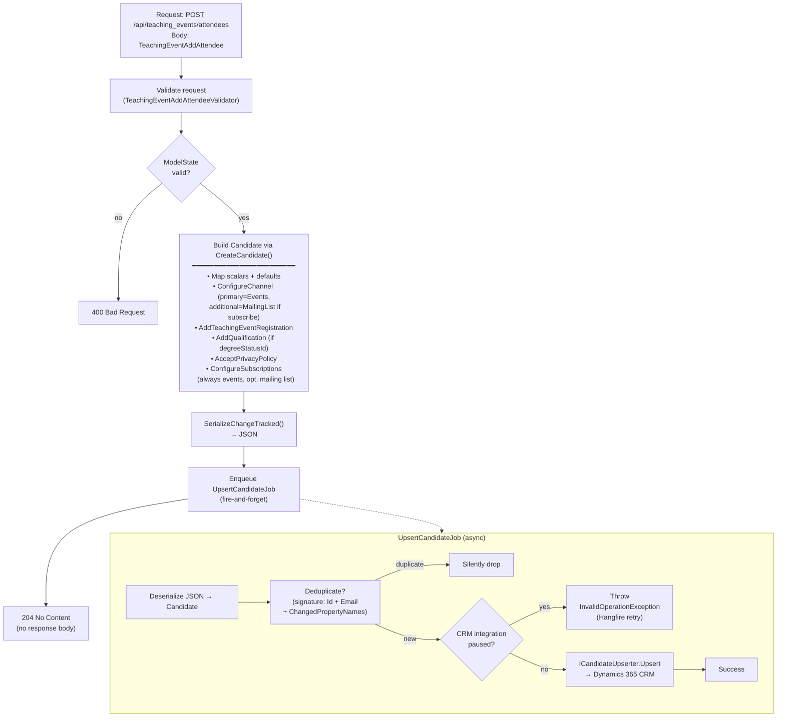

## POST `/api/teaching_events/attendees`

Please check existing code and swagger doc for reference. I might have made mistakes or missed something here.
https://getintoteachingapi-test.test.teacherservices.cloud/swagger/index.html

**File:** `Controllers/GetIntoTeaching/TeachingEventsController.cs:129`

Registers a candidate as an attendee for a teaching event. Builds a `Candidate` from the request fields, attaches a `TeachingEventRegistration`, configures subscriptions (always events, optionally mailing list), serializes with change tracking, and enqueues an `UpsertCandidateJob` to persist to CRM. Requires `Admin` or `GetIntoTeaching` role.

The CRM upsert is asynchronous — the endpoint returns immediately after enqueuing the job.

## What it does (step by step)

1. **Authorization** — requires `Admin` or `GetIntoTeaching` role
2. **Validates request** — FluentValidation via `TeachingEventAddAttendeeValidator`; returns `400` with serialized errors if invalid
3. **Injects DateTimeProvider** — sets `request.DateTimeProvider = _dateTime` (for testability / contract tests)
4. **Builds Candidate** — calls `request.Candidate` (computed property, `[JsonIgnore]`) which constructs a `Candidate`:
   - **Maps scalar fields**: `Id`, `Email`, `FirstName`, `LastName`, `AddressPostcode` (formatted via `AsFormattedPostcode()`), `AddressTelephone`, `PreferredPhoneNumberTypeId` (Home), `PreferredContactMethodId` (Any), `GdprConsentId` (Consent), `OptOutOfGdpr` (false)
   - **Conditional fields**: `ConsiderationJourneyStageId`, `PreferredTeachingSubjectId` (only set if non-null)
   - **Configures channel** via `ConfigureChannel()`:
     - Primary channel: `ICreateContactChannel` (this = `TeachingEventAddAttendee`) — defaults to Source=GITWebsite, Service=Events, Activity=null
     - Additional channel (`AdditionalMailingListContactChannel`): created only if `SubscribeToMailingList` is true — defaults to Source=GITWebsite, Service=MailingList, Activity=null
     - The `ChannelId` fallback (`DefaultContactCreationChannel`) returns `ChannelId ?? Candidate.Channel.Event`
   - **Adds teaching event registration** via `AddTeachingEventRegistration()` — creates a `TeachingEventRegistration` linked to `EventId`; channel depends on `IsWalkIn` / `IsVerified` (see below)
   - **Adds qualification** via `AddQualification()` — creates a `CandidateQualification` with `DegreeStatusId`, `TypeId = Degree`, and `Id = QualificationId` (for updates)
   - **Accepts privacy policy** via `AcceptPrivacyPolicy()` — creates `CandidatePrivacyPolicy` with `AcceptedPolicyId` and current timestamp
   - **Configures subscriptions** via `ConfigureSubscriptions()`:
     - Always subscribes to events via `SubscriptionManager.SubscribeToEvents()`
     - Conditionally subscribes to mailing list via `SubscriptionManager.SubscribeToMailingList()` when `SubscribeToMailingList` is true
5. **Serializes** — `request.Candidate.SerializeChangeTracked()` serializes only changed properties
6. **Enqueues** — `_jobClient.Enqueue<UpsertCandidateJob>(x => x.Run(json, null))` (async CRM upsert, fire-and-forget)
7. **Returns** — `204 No Content`

## Request

Body: a `TeachingEventAddAttendee` JSON object.

```json
{
  "candidateId": null,
  "qualificationId": null,
  "eventId": "3fa85f64-5717-4562-b3fc-2c963f66afa6",
  "channelId": null,
  "acceptedPolicyId": "3fa85f64-5717-4562-b3fc-2c963f66afa6",
  "preferredTeachingSubjectId": "3fa85f64-5717-4562-b3fc-2c963f66afa6",
  "considerationJourneyStageId": 222750001,
  "degreeStatusId": 222750000,
  "email": "jane.doe@example.com",
  "firstName": "Jane",
  "lastName": "Doe",
  "addressPostcode": "TE5 1IN",
  "addressTelephone": "07123456789",
  "isVerified": true,
  "isWalkIn": false,
  "subscribeToMailingList": false,
  "alreadySubscribedToEvents": false,
  "alreadySubscribedToMailingList": false,
  "alreadySubscribedToTeacherTrainingAdviser": false,
  "accessibilityNeedsForEvent": null
}
```

### Key fields

| Field | Type | Required | Notes |
|-------|------|----------|-------|
| `eventId` | `Guid` | **Yes** | ID of the teaching event to register for; must exist in the store and have a non-null `WebFeedId` |
| `email` | `string` | **Yes** | Candidate email (non-empty) |
| `firstName` | `string` | **Yes** | Candidate first name (non-empty) |
| `lastName` | `string` | **Yes** | Candidate last name (non-empty) |
| `acceptedPolicyId` | `Guid` | **Yes** | Privacy policy ID the candidate accepted |
| `candidateId` | `Guid` | No | If set, updates the existing candidate; otherwise creates a new one |
| `qualificationId` | `Guid` | No | If set, updates the existing qualification; otherwise creates a new one |
| `channelId` | `int` | No (WriteOnly) | Overrides the default event channel ID (`222750029`); falls back to `Candidate.Channel.Event` |
| `creationChannelSourceId` | `int` | No (WriteOnly) | Overrides default GIT Website source (`222750003`) |
| `creationChannelServiceId` | `int` | No (WriteOnly) | Overrides default Events service (`222750029`) |
| `creationChannelActivityId` | `int` | No (WriteOnly) | Overrides default null activity |
| `preferredTeachingSubjectId` | `Guid` | No | Preferred teaching subject |
| `considerationJourneyStageId` | `int` | No | Consideration journey stage |
| `degreeStatusId` | `int` | No | Degree status; if set, creates/updates a `CandidateQualification` with `TypeId = Degree` |
| `addressPostcode` | `string` | No | UK postcode; formatted via `AsFormattedPostcode()`; affects events subscription type (LocalEvent vs SingleEvent) |
| `addressTelephone` | `string` | No | Phone number |
| `isVerified` | `bool` | No | Defaults to `true`. Must be `true` unless `isWalkIn` is `true`. Affects registration channel |
| `isWalkIn` | `bool` | No (WriteOnly) | Whether the attendee is a walk-in. Affects registration channel |
| `subscribeToMailingList` | `bool` | No (WriteOnly) | If `true`, also subscribes the candidate to the mailing list; then `considerationJourneyStageId`, `degreeStatusId`, and `preferredTeachingSubjectId` become required |
| `alreadySubscribedToEvents` | `bool` | No (ReadOnly) | Pre-populated when returning an existing candidate (exchange endpoints) |
| `alreadySubscribedToMailingList` | `bool` | No (ReadOnly) | Pre-populated when returning an existing candidate (exchange endpoints) |
| `alreadySubscribedToTeacherTrainingAdviser` | `bool` | No (ReadOnly) | Pre-populated when returning an existing candidate (exchange endpoints) |
| `accessibilityNeedsForEvent` | `string` | No | Accessibility needs for the specific event; stored on the `TeachingEventRegistration` |

## Responses

### `204 No Content` — attendee registration queued

No response body. The candidate and registration are persisted asynchronously via `UpsertCandidateJob`.

### `400 Bad Request` — validation failed. New proposed error format

```json
{
    "errors": [
        {
            "error": "BadRequest",
            "message": "EventId must not be empty",
            "attribute": "EventId"
        }
    ]
}
```

Possible validation failures:

- `EventId` is empty, does not reference an existing teaching event, or the event has no `WebFeedId` (not available for online registration)
- `FirstName` is empty
- `LastName` is empty
- `Email` is empty, not a valid email address, or exceeds 100 characters
- `AcceptedPolicyId` is empty
- `IsVerified` is `false` and `IsWalkIn` is `false` (unverified only allowed for walk-ins)
- `ConsiderationJourneyStageId` is null when `SubscribeToMailingList` is true
- `DegreeStatusId` is null when `SubscribeToMailingList` is true
- `PreferredTeachingSubjectId` is null when `SubscribeToMailingList` is true
- `AddressTelephone` fails format validation (min 5, max 25 chars, no letters)
- `AddressPostcode` is not a valid UK postcode
- `ChannelId` is not a valid picklist item for `dfe_channelcreation` (on new registrations)
- `ChannelId` is non-null on an existing registration (channel cannot be changed)

### `404 Not Found` — candidate not found (only for exchange endpoints). New proposed error format

```json
{
    "errors": [
        {
            "error": "NotFound",
            "message": "Candidate could not be matched."
            "attribute": "Candidate"
        }
    ]
}
```

The `POST /api/teaching_events/attendees` endpoint itself does not return 404. The exchange endpoints (`exchange_access_token`, `exchange_unverified_request`) return 404 when the candidate cannot be matched.

## TeachingEventRegistration channel logic

The `ChannelId` on the `TeachingEventRegistration` is determined by `IsWalkIn` and `IsVerified`:

| `IsWalkIn` | `IsVerified` | Channel | Value |
|---|---|---|---|
| `false` | any | `Event` | `222750003` |
| `true` | `true` | `EventWalkIn` | `222750004` |
| `true` | `false` | `EventWalkInUnverified` | `222750005` |

When `IsWalkIn` is `false`, the channel is always `Event` (222750003) regardless of `IsVerified`.

## Subscription behaviour

| Subscription | Always? | Condition |
|---|---|---|
| Events | **Yes** | Always subscribed via `SubscriptionManager.SubscribeToEvents()` |
| Mailing list | No | Only if `SubscribeToMailingList` is `true` |

Events subscription type varies by `AddressPostcode`:
- If `AddressPostcode` is null/empty → `SingleEvent` (222750001)
- If `AddressPostcode` is set → `LocalEvent` (222750000)

## Persistence order (async job)



## Key business rules

| Rule | Detail |
|------|--------|
| **Event availability** | The event must have a non-null `WebFeedId` to accept online registrations. Checked in `TeachingEventRegistrationValidator.BeAvailableForOnlineRegistrations()` via `_store.GetTeachingEventAsync(id)` |
| **Event existence** | The event must exist in the store (local cache / DB). Checked in `TeachingEventRegistrationValidator.BeAValidTeachingEvent()` |
| **Registration channel immutability** | Once a `TeachingEventRegistration` has been created (has an `Id`), its `ChannelId` cannot be changed. Attempting to do so returns a validation error |
| **Walk-in vs verified** | `IsVerified` defaults to `true`. It can only be `false` when `IsWalkIn` is `true`. Unverified walk-ins get `Channel.EventWalkInUnverified` (222750005) |
| **Mailing list gating** | When `SubscribeToMailingList` is true, three extra fields become required: `ConsiderationJourneyStageId`, `DegreeStatusId`, `PreferredTeachingSubjectId` |
| **Candidate channel config** | The primary creation channel is always Events (Source=GITWebsite, Service=Events). If `SubscribeToMailingList` is true, an additional MailingList channel is also created |
| **Default contact channel** | `DefaultContactCreationChannel` returns `ChannelId ?? Candidate.Channel.Event`. The `ChannelId` override is WriteOnly |
| **Exit code stripping** | `AddressTelephone` has its UK exit code stripped via `StripExitCode()` when pre-populated from an existing candidate (exchange endpoints only) |
| **Postcode formatting** | `AddressPostcode` is formatted via `AsFormattedPostcode()` before being stored |
| **Subscription opt-out safety** | `SubscriptionManager.ConsentValue` never opts out if already consented (`currentValue == false` preserves `false`) |
| **Async persistence** | The endpoint returns `204 No Content` before the CRM write happens. Failures are handled by Hangfire retry + notification email |
| **Deduplication** | `UpsertCandidateJob` deduplicates by signature `$"{candidate.Id}-{candidate.Email}-{string.Join("", candidate.ChangedPropertyNames)}"`. Duplicates are silently dropped |
| **CRM pause** | If CRM integration is paused, `UpsertCandidateJob` throws `InvalidOperationException` and Hangfire retries |
| **Last-attempt notification** | On the final Hangfire retry of `UpsertCandidateJob`, a failure notification email is sent via GOV.UK Notify and the job succeeds (fire-and-forget) |
