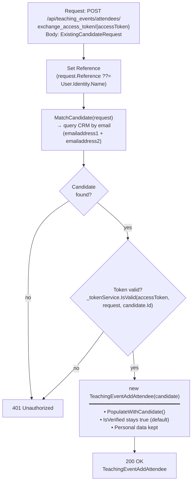

## POST `/api/teaching_events/attendees/exchange_access_token/{accessToken}`

Please check existing code and swagger doc for reference. I might have made mistakes or missed something here.
https://getintoteachingapi-test.test.teacherservices.cloud/swagger/index.html

**File:** `Controllers/GetIntoTeaching/TeachingEventsController.cs:191`

Retrieves a pre-populated `TeachingEventAddAttendee` for an existing candidate after verifying their access token (TOTP). The candidate is matched by email and the token is validated against the request payload. The returned attendee has all personal data intact and `IsVerified = true`. Requires `Admin` or `GetIntoTeaching` role.

The `accessToken` is obtained from a `POST /candidates/access_tokens` request. The `ExistingCandidateRequest` payload used here must match the one used to generate the token.

## What it does (step by step)

1. **Authorization** — requires `Admin` or `GetIntoTeaching` role
2. **Sets reference** — `request.Reference ??= User.Identity.Name`
3. **Matches candidate** — calls `_crm.MatchCandidate(request)` which queries CRM for an active contact matching the request email (checks both `emailaddress1` and `emailaddress2`)
4. **Returns 401** — if no matching candidate is found, returns `401 Unauthorized`
5. **Verifies token** — calls `_tokenService.IsValid(accessToken, request, candidate.Id)`; the token is a TOTP (6 digits, 30-second step) derived from `request.Slugify()` + a server-side secret key
6. **Returns 401** — if the token is invalid, returns `401 Unauthorized`
7. **Constructs attendee** — creates `new TeachingEventAddAttendee(candidate)` which calls `PopulateWithCandidate()`:
   - **Qualification**: takes the latest qualification (by `CreatedAt` descending) and maps `QualificationId` and `DegreeStatusId`
   - **Scalar fields**: `CandidateId`, `PreferredTeachingSubjectId`, `ConsiderationJourneyStageId`, `Email`, `FirstName`, `LastName`, `AddressPostcode`
   - **Telephone**: `AddressTelephone` with UK exit code stripped via `StripExitCode()`
   - **Subscription status**: `AlreadySubscribedToMailingList`, `AlreadySubscribedToEvents`, `AlreadySubscribedToTeacherTrainingAdviser`
8. **Returns** — `200 OK` with the pre-populated `TeachingEventAddAttendee` in the response body

## Request

Route parameter `accessToken` (string, required) — the 6-digit PIN code obtained from `POST /candidates/access_tokens`.

Body: an `ExistingCandidateRequest` JSON object.

```json
{
  "email": "jane.doe@example.com",
  "firstName": "Jane",
  "lastName": "Doe",
  "dateOfBirth": "1990-01-15",
  "reference": null
}
```

**Important:** The body payload must match exactly the one used to generate the `accessToken`, because the token is derived from `request.Slugify()` (email + first name + last name + date of birth, joined by `-` and lowercased).

### Key fields

| Field | Type | Required | Notes |
|-------|------|----------|-------|
| `email` | `string` | **Yes** | Candidate email; used to match the candidate in CRM (checked against `emailaddress1` and `emailaddress2`) and included in the token seed |
| `firstName` | `string` | No | Included in the token seed; must match the value used at token generation |
| `lastName` | `string` | No | Included in the token seed; must match the value used at token generation |
| `dateOfBirth` | `DateTime` | No | Included in the token seed if provided; must match the value used at token generation |
| `reference` | `string` | No | Falls back to `User.Identity.Name` if not set |

## Responses

### `200 OK` — pre-populated attendee returned (verified)

```json
{
  "candidateId": "a1b2c3d4-...",
  "qualificationId": "e5f6g7h8-...",
  "eventId": null,
  "channelId": null,
  "acceptedPolicyId": null,
  "preferredTeachingSubjectId": "3fa85f64-5717-4562-b3fc-2c963f66afa6",
  "considerationJourneyStageId": 222750001,
  "degreeStatusId": 222750000,
  "email": "jane.doe@example.com",
  "firstName": "Jane",
  "lastName": "Doe",
  "addressPostcode": "TE5 1IN",
  "addressTelephone": "07123456789",
  "isVerified": true,
  "isWalkIn": false,
  "subscribeToMailingList": false,
  "alreadySubscribedToEvents": false,
  "alreadySubscribedToMailingList": false,
  "alreadySubscribedToTeacherTrainingAdviser": false,
  "accessibilityNeedsForEvent": null
}
```

Unlike the `exchange_unverified_request` endpoint:
- `IsVerified` is `true` (candidate is treated as verified)
- `AddressPostcode` is populated from the candidate (not cleared)
- `AddressTelephone` is populated from the candidate with exit code stripped (not cleared)

### `400 Bad Request` — validation failed. New proposed error format

```json
{
    "errors": [
        {
            "error": "BadRequest",
            "message": "Email must not be empty",
            "attribute": "Email"
        }
    ]
}
```

Possible validation failures:

- `Email` is empty, not a valid email address, or exceeds 100 characters (validated by `ExistingCandidateRequestValidator`)

### `401 Unauthorized` — candidate not matched or invalid token. New proposed error format

```json
{
    "errors": [
        {
            "error": "Unauthorized",
            "message": "Candidate could not be matched or access token is invalid.",
            "attribute": "Candidate"
        }
    ]
}
```

Returned when either:
1. No active CRM contact matches the provided email
2. The candidate exists but the `accessToken` is invalid or expired

Note: Despite the Swagger attribute `[ProducesResponseType(404)]`, the actual response status code is `401 Unauthorized` for both failure cases (short-circuit evaluation: if `candidate == null`, the token check is skipped).

## Token verification (TOTP)

Token verification is performed by `CandidateAccessTokenService.IsValid()`:

| Parameter | Value |
|-----------|-------|
| Algorithm | TOTP (OtpNet library) |
| Token length | 6 digits |
| Time step | 30 seconds |
| Verification window | 30 steps (previous only, ~15 minutes) |
| Shared secret | `request.Slugify() + TotpSecretKey` (ASCII-encoded) |

The `Slugify()` method builds: `email-firstname-lastname-MM-dd-yyyy` (lowercased), with null values omitted. This slug is concatenated with the server-side `TotpSecretKey` (from environment) to form the HMAC key.

## Match logic

Same as `exchange_unverified_request`. Matching is performed by `CrmService.MatchCandidate(ExistingCandidateRequest)`:

1. Builds a query using `MatchBackQuery(request.Email)` — checks both `emailaddress1` and `emailaddress2` for any of the candidate's equivalent email variants (via `EmailReconciler.EquivalentEmails`)
2. Limits to `MaximumNumberOfCandidatesToMatch` results
3. Filters to active contacts only (`statecode == Active`)
4. Orders by `dfe_duplicatescorecalculated` (descending) then `modifiedon` (descending)
5. Takes the first match
6. Loads all candidate relationships (qualifications, subscriptions, etc.)

## Flow



## Key business rules

| Rule | Detail |
|------|--------|
| **Match by email only** | The candidate is matched solely by email (both primary and secondary) |
| **Active contacts only** | Only candidates with `statecode == Active` are returned |
| **Token payload must match** | The `ExistingCandidateRequest` body must exactly match the one used to generate the token (the slug is used as the TOTP seed) |
| **Token expiry** | TOTP window covers 30 steps × 30 seconds (~15 minutes) in the past; tokens beyond that window are rejected |
| **Verified access** | `IsVerified` retains its default value of `true` — the candidate is treated as verified |
| **Personal data kept** | `AddressPostcode` and `AddressTelephone` are returned with the candidate's actual values (unlike `exchange_unverified_request`) |
| **401 for both failures** | Whether the candidate is not found or the token is invalid, the endpoint returns `401 Unauthorized` (not 404) |
| **Short-circuit evaluation** | If `candidate == null`, the token check is skipped entirely (`||` short-circuit), avoiding an `InvalidOperationException` on the `(Guid)candidate.Id` cast |
| **No side effects** | This endpoint is read-only with respect to CRM — it does not create, update, or enqueue anything |
| **Subscription read-only flags** | `AlreadySubscribedToEvents`, `AlreadySubscribedToMailingList`, `AlreadySubscribedToTeacherTrainingAdviser` are populated from the candidate's CRM state but are ReadOnly in Swagger |

## Related models

| Model | File | Notes |
|-------|------|-------|
| `ExistingCandidateRequest` | `Models/ExistingCandidateRequest.cs` | Request model; used to match an existing candidate and as input to TOTP seed generation |
| `ExistingCandidateRequestValidator` | `Models/Validators/ExistingCandidateRequestValidator.cs` | Validates email is not empty and is a valid format |
| `TeachingEventAddAttendee` | `Models/GetIntoTeaching/TeachingEventAddAttendee.cs` | Response model; pre-populated from the matched candidate |
| `Candidate` | `Models/Crm/Candidate.cs` | CRM entity `contact`; `[SwaggerIgnore]` |
| `ICandidateAccessTokenService` | `Services/ICandidateAccessTokenService.cs` | Defines `IsValid(string, ExistingCandidateRequest, Guid)` |
| `CandidateAccessTokenService` | `Services/CandidateAccessTokenService.cs` | TOTP-based token verification; 6 digits, 30s step, 30-step window |
| `ICrmService` | `Services/ICrmService.cs` | Defines `MatchCandidate(ExistingCandidateRequest)` |
| `CrmService` | `Services/CrmService.cs` | Implements match via `MatchBackQuery` (email on `emailaddress1` + `emailaddress2`) |
