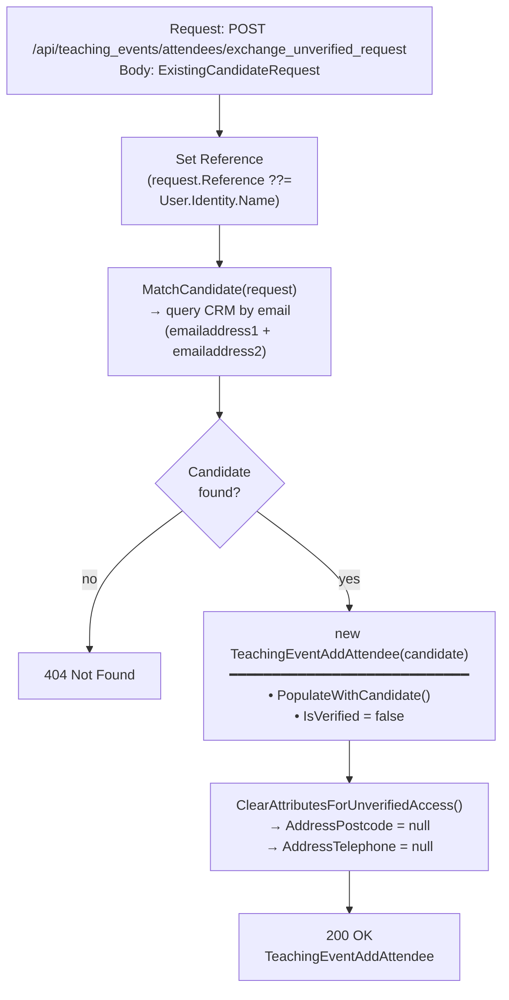

## POST `/api/teaching_events/attendees/exchange_unverified_request`

Please check existing code and swagger doc for reference. I might have made mistakes or missed something here.
https://getintoteachingapi-test.test.teacherservices.cloud/swagger/index.html

**File:** `Controllers/GetIntoTeaching/TeachingEventsController.cs:157`

Retrieves a pre-populated `TeachingEventAddAttendee` for an existing candidate matched by email, allowing the client to proceed with event registration as "unverified". The returned attendee has `IsVerified = false` and personal data fields (`AddressPostcode`, `AddressTelephone`) cleared. Requires `Admin` or `GetIntoTeaching` role.

This mechanism should be used with caution — the candidate is treated as unverified by the client.

## What it does (step by step)

1. **Authorization** — requires `Admin` or `GetIntoTeaching` role
2. **Sets reference** — `request.Reference ??= User.Identity.Name` (sets the reference to the authenticated user's name if not already provided)
3. **Matches candidate** — calls `_crm.MatchCandidate(request)` which queries CRM for an active contact matching the request email (checks both `emailaddress1` and `emailaddress2`)
4. **Returns 404** — if no matching candidate is found, returns `404 Not Found`
5. **Constructs attendee** — creates `new TeachingEventAddAttendee(candidate)` which calls `PopulateWithCandidate()`:
   - **Qualification**: takes the latest qualification (by `CreatedAt` descending) and maps `QualificationId` and `DegreeStatusId`
   - **Scalar fields**: `CandidateId`, `PreferredTeachingSubjectId`, `ConsiderationJourneyStageId`, `Email`, `FirstName`, `LastName`, `AddressPostcode`
   - **Telephone**: `AddressTelephone` with UK exit code stripped via `StripExitCode()`
   - **Subscription status**: `AlreadySubscribedToMailingList`, `AlreadySubscribedToEvents`, `AlreadySubscribedToTeacherTrainingAdviser`
6. **Sets IsVerified = false** — marks the attendee as unverified
7. **Clears personal data** — calls `ClearAttributesForUnverifiedAccess()` which nulls `AddressPostcode` and `AddressTelephone` (keeps `FirstName`, `LastName`, `Email` for matchback)
8. **Returns** — `200 OK` with the pre-populated `TeachingEventAddAttendee` in the response body

## Request

Body: an `ExistingCandidateRequest` JSON object.

```json
{
  "email": "jane.doe@example.com",
  "firstName": "Jane",
  "lastName": "Doe",
  "dateOfBirth": "1990-01-15",
  "reference": null
}
```

### Key fields

| Field | Type | Required | Notes |
|-------|------|----------|-------|
| `email` | `string` | **Yes** | Candidate email; used to match the candidate in CRM (checked against `emailaddress1` and `emailaddress2`) |
| `firstName` | `string` | No | Used for the pre-populated attendee; the match is by email only |
| `lastName` | `string` | No | Used for the pre-populated attendee; the match is by email only |
| `dateOfBirth` | `DateTime` | No | Not used for matching in this endpoint (match is by email only) |
| `reference` | `string` | No | Falls back to `User.Identity.Name` if not set |

## Responses

### `200 OK` — pre-populated attendee returned

```json
{
  "candidateId": "a1b2c3d4-...",
  "qualificationId": "e5f6g7h8-...",
  "eventId": null,
  "channelId": null,
  "acceptedPolicyId": null,
  "preferredTeachingSubjectId": "3fa85f64-5717-4562-b3fc-2c963f66afa6",
  "considerationJourneyStageId": 222750001,
  "degreeStatusId": 222750000,
  "email": "jane.doe@example.com",
  "firstName": "Jane",
  "lastName": "Doe",
  "addressPostcode": null,
  "addressTelephone": null,
  "isVerified": false,
  "isWalkIn": false,
  "subscribeToMailingList": false,
  "alreadySubscribedToEvents": false,
  "alreadySubscribedToMailingList": false,
  "alreadySubscribedToTeacherTrainingAdviser": false,
  "accessibilityNeedsForEvent": null
}
```

`AddressPostcode` and `AddressTelephone` are always `null` — they are cleared by `ClearAttributesForUnverifiedAccess()`. The subscription flags (`AlreadySubscribedTo*`) reflect the candidate's current CRM state.

### `400 Bad Request` — validation failed. New proposed error format

```json
{
    "errors": [
        {
            "error": "BadRequest",
            "message": "Email must not be empty",
            "attribute": "Email",
        }
    ]
}
```

Possible validation failures:

- `Email` is empty, not a valid email address, or exceeds 100 characters (validated by `ExistingCandidateRequestValidator`)

### `404 Not Found` — candidate not matched. New proposed error format

```json
{
    "errors": [
        {
            "error": "NotFound",
            "message": "Candidate could not be matched."
        }
    ]
}
```

Returned when no active CRM contact matches the provided email.

## Match logic

Matching is performed by `CrmService.MatchCandidate(ExistingCandidateRequest)`:

1. Builds a query using `MatchBackQuery(request.Email)` — checks both `emailaddress1` and `emailaddress2` for any of the candidate's equivalent email variants (via `EmailReconciler.EquivalentEmails`)
2. Limits to `MaximumNumberOfCandidatesToMatch` results
3. Filters to active contacts only (`statecode == Active`)
4. Orders by `dfe_duplicatescorecalculated` (descending) then `modifiedon` (descending)
5. Takes the first match
6. Loads all candidate relationships (qualifications, subscriptions, etc.)

## ClearAttributesForUnverifiedAccess

Called on the pre-populated attendee before returning. Nulls out personal data fields that aren't needed for matchback:

| Field | Cleared? | Reason |
|-------|----------|--------|
| `AddressPostcode` | **Yes** | Personal data, cleared |
| `AddressTelephone` | **Yes** | Personal data, cleared |
| `FirstName` | No | Kept for matchback (display purposes) |
| `LastName` | No | Kept for matchback (display purposes) |
| `Email` | No | Kept for matchback (display purposes) |

## Flow



## Key business rules

| Rule | Detail |
|------|--------|
| **Match by email only** | The candidate is matched solely by email (both primary and secondary). `FirstName`, `LastName`, and `DateOfBirth` are not used for matching |
| **Active contacts only** | Only candidates with `statecode == Active` are returned |
| **Duplicate handling** | Results are ordered by `dfe_duplicatescorecalculated` (desc) then `modifiedon` (desc); the first result is taken |
| **Unverified access** | `IsVerified` is set to `false`, signalling to the client that the candidate should be treated as unverified |
| **Personal data cleared** | `AddressPostcode` and `AddressTelephone` are nulled to avoid pre-filling sensitive data for unverified sessions |
| **Subscription read-only flags** | `AlreadySubscribedToEvents`, `AlreadySubscribedToMailingList`, `AlreadySubscribedToTeacherTrainingAdviser` are populated from the candidate's CRM state but are ReadOnly in Swagger |
| **No side effects** | This endpoint is read-only with respect to CRM — it does not create, update, or enqueue anything |
| **No event registration** | Unlike the main `POST /api/teaching_events/attendees`, this endpoint does not enqueue `UpsertCandidateJob`. It only returns a pre-populated request object |
| **Reference assignment** | `Reference` defaults to the authenticated user's identity name if not provided by the client |

## Proposed changes
### Require dateOfBirth param

This endpoint has been flagged as a potential security risk because the only required param is `email`. This makes it easy to get information on candidates.

We propose to make `dateOfBirth` param required along side the `email`.
