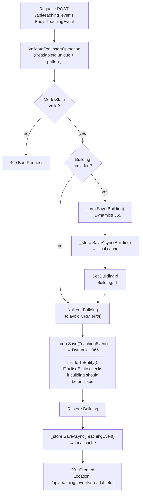

## POST `/api/teaching_events`

Please check existing code and swagger doc for reference. I might have made mistakes or missed something here.
https://getintoteachingapi-test.test.teacherservices.cloud/swagger/index.html

**File:** `Controllers/GetIntoTeaching/TeachingEventsController.cs:207`

Adds or updates a teaching event. If the payload includes an `id` the existing event is updated, otherwise a new one is created. Persists both the event and its venue (building) to Dynamics 365 CRM and the local database cache. Requires `Admin` or `GetIntoTeaching` role.

## What it does (step by step)

1. **Authorization** — requires `Admin` or `GetIntoTeaching` role
2. **Validates ReadableId** — calls `ValidateForUpsertOperation(teachingEvent)` which creates a `TeachingEventUpsertOperation` (extracts `Id` and `ReadableId`) and validates:
   - `ReadableId` matches regex `\A[^_\W][\w-]+[^_\W]\Z`
   - `ReadableId` is unique — queries CRM via `_crm.GetTeachingEvent(readableId)`. If a different event already has that `ReadableId`, validation fails with `"Must be unique"`
3. **Checks ModelState** — if invalid, returns `400 Bad Request`
4. **Persists building** — if `teachingEvent.Building` is not null:
   - Saves building to CRM via `_crm.Save(teachingEvent.Building)`
   - Saves building to local cache via `_store.SaveAsync(teachingEvent.Building)`
   - Sets `teachingEvent.BuildingId = teachingEvent.Building.Id`
5. **Persists event**:
   - Temporarily removes `teachingEvent.Building` (to prevent a CRM error from the nested relationship)
   - Saves event to CRM via `_crm.Save(teachingEvent)`
   - Restores `teachingEvent.Building`
   - Saves event (including building) to local cache via `_store.SaveAsync(teachingEvent)`
6. **Finalises entity** — `TeachingEvent.FinaliseEntity()` runs during `ToEntity()`, before the CRM save commits. If `Building` is null on the payload but the existing event in CRM has a building, it marks the building relationship link for deletion (committed in the same transaction)
7. **Returns** — `201 Created` with the `TeachingEvent` in the response body and a `Location` header pointing to `GET /api/teaching_events/{readableId}`

## Request

Body: a `TeachingEvent` JSON object.

```json
{
  "typeId": 222750000,
  "statusId": 222750000,
  "readableId": "my-event-2024",
  "name": "My Event",
  "summary": "A summary of the event",
  "description": "A full description of the event",
  "startAt": "2024-06-01T09:00:00Z",
  "endAt": "2024-06-01T17:00:00Z",
  "isOnline": false,
  "building": {
    "venue": "Venue Name",
    "addressLine1": "123 Street",
    "addressCity": "London",
    "addressPostcode": "SW1A 1AA"
  }
}
```

### Key fields

| Field | Type | Required | Notes |
|-------|------|----------|-------|
| `typeId` | `int` | **Yes** | Event type (e.g. `ApplicationWorkshop = 222750000`, `TrainToTeachEvent = 222750001`) |
| `statusId` | `int` | **Yes** | Event status (e.g. `Open = 222750000`, `Closed = 222750001`, `Draft = 222750002`, `Pending = 222750003`) |
| `readableId` | `string` | **Yes** | URL-friendly unique identifier; must match regex `\A[^_\W][\w-]+[^_\W]\Z` and be unique across all events |
| `name` | `string` | **Yes** | Event name |
| `startAt` | `DateTime` | **Yes** | Event start time |
| `endAt` | `DateTime` | **Yes** | Event end time; must be >= `startAt` |
| `isOnline` | `bool` | No | Whether the event is online |
| `building` | `TeachingEventBuilding` | No | Venue details; if provided, the building is persisted first and linked to the event |
| `webFeedId` | `string` | No | If set, the API will accept new attendees for this event (external sign-up used if nil) |
| `summary` | `string` | No | Short event summary |
| `description` | `string` | No | Full event description |
| `videoUrl` | `string` | No | Video link for online events |
| `providerWebsiteUrl` | `string` | No | Provider's website URL |
| `providerTargetAudience` | `string` | No | Target audience description |
| `providerOrganiser` | `string` | No | Organiser name |
| `providerContactEmail` | `string` | No | Contact email (validated for email format, max 100 chars) |
| `providersList` | `string` | No | Comma-separated list of providers |
| `regionId` | `int?` | No | Region option set value |
| `message` | `string` | No | Miscellaneous message (e.g. if event is nearly booked out) |
| `scribbleId` | `string` | No | Scribble ID |
| `accessibilityOptions` | `int[]` | No | Array of accessibility option set values |

### Building fields

| Field | Type | Notes |
|-------|------|-------|
| `venue` | `string` | Required; venue name |
| `addressLine1` | `string` | Address line 1 |
| `addressLine2` | `string` | Address line 2 |
| `addressLine3` | `string` | Address line 3 |
| `addressCity` | `string` | City |
| `addressPostcode` | `string` | Required; validated as a UK postcode |
| `imageUrl` | `string` | Event venue image URL |

## Responses

### `201 Created` — event created or updated

The response body contains the `TeachingEvent` (including the building if one was provided). The `Location` header points to `GET /api/teaching_events/{readableId}`.

```json
{
  "id": "a1b2c3d4-...",
  "typeId": 222750000,
  "statusId": 222750000,
  "readableId": "my-event-2024",
  "name": "My Event",
  "summary": "A summary of the event",
  "description": "A full description of the event",
  "message": null,
  "startAt": "2024-06-01T09:00:00Z",
  "endAt": "2024-06-01T17:00:00Z",
  "isOnline": false,
  "isVirtual": false,
  "isInPerson": true,
  "building": {
    "id": "b2c3d4e5-...",
    "venue": "Venue Name",
    "addressLine1": "123 Street",
    "addressLine2": null,
    "addressLine3": null,
    "addressCity": "London",
    "addressPostcode": "SW1A 1AA",
    "imageUrl": null
  },
  "webFeedId": null,
  "videoUrl": null,
  "providerWebsiteUrl": null,
  "providerTargetAudience": null,
  "providerOrganiser": null,
  "providerContactEmail": null,
  "providersList": null,
  "regionId": null,
  "scribbleId": null,
  "accessibilityOptions": []
}
```

### `400 Bad Request` — validation failed. New proposed error format

```json
{
    "errors": [
        {
            "error": "BadRequest",
            "message": "ReadableId does not match the required pattern",
            "attribute": "ReadableId"
        }
    ]
}
```

Possible validation failures:

- `ReadableId` does not match the required pattern (`\A[^_\W][\w-]+[^_\W]\Z`)
- `ReadableId` is not unique (another event already uses it)
- `ReadableId` is empty
- `Name` is empty
- `ProviderContactEmail` is not a valid email address or exceeds 100 characters
- `EndAt` is before `StartAt`
- Building `Venue` is empty
- Building `AddressPostcode` is not a valid UK postcode

## Persistence order



## Key business rules

| Rule | Detail |
|------|--------|
| **ReadableId uniqueness** | Checked against CRM via `_crm.GetTeachingEvent(readableId)`. Succeeds if no event has that `ReadableId`, or if the only match has the same `Id` as the payload (update scenario) |
| **ReadableId format** | Must match `\A[^_\W][\w-]+[^_\W]\Z` — cannot start/end with underscore or non-word character, allows word characters and hyphens |
| **Building persistence order** | Building is saved to CRM first (to generate its `Id`), then the event is saved with the building's `Id` assigned. This avoids a CRM foreign key error |
| **Building null-out during event save** | `TeachingEvent.Building` is temporarily set to null before calling `_crm.Save()` on the event to prevent a CRM relationship error. The `Building` object is restored afterwards for the cache write |
| **Building link removal** | If the payload has no `Building` but the existing event in CRM has one, `FinaliseEntity` marks the building relationship link for deletion during the `ToEntity()` call (committed in the same `SaveChanges` transaction) |
| **Audience filtering** | `IsOnline` set to `false` means the event is in-person; if `isOnline = true` and `building.AddressPostcode` is not null/empty, `IsVirtual` returns `true` and `IsInPerson` returns `true` (virtual events are treated as in-person for search filtering) |
| **ReadableId populates InternalName** | Setting the `Name` property also sets the CRM-internal `InternalName` (`msevtmgt_name`) property to the same value |
| **Timezone hard-coded** | `InternalTimeZone` is fixed to GMT (`GmtTimeZoneCode = 85`) |
