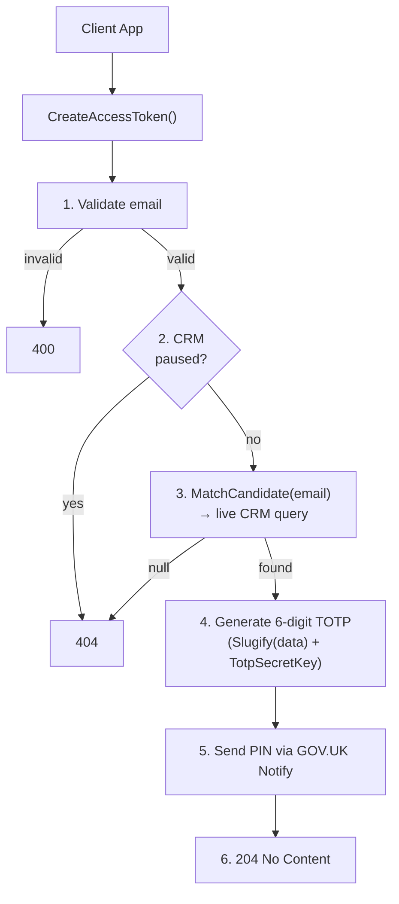

## POST `/api/candidates/access_tokens`

Please check existing code and swagger doc for reference
https://getintoteachingapi-test.test.teacherservices.cloud/swagger/index.html

**File:** `Controllers/CandidatesController.cs:52`

Finds an existing candidate in CRM by email, generates a 6-digit TOTP PIN from their data + server `TOTP_SECRET_KEY`, emails it to them via GOV.UK Notify, and returns `204 No Content`. The PIN is later exchanged at `exchange_access_token` endpoints to prove email ownership and get pre-populated data.

## What it does (step by step)

1. Sets `request.Reference` to `User.Identity.Name` (JWT client ID) if not already set. I think this is used to know which client requested the pim. Apply, GIT, etc.
2. Validates the email (non-empty, valid format, max 100 chars) — returns `400` if invalid
3. Checks if CRM integration is paused (Redis-backed flag) — returns `404` if paused (masks candidate existence)
4. Calls `_crm.MatchCandidate(request)` — live CRM query: searches `emailaddress1`/`emailaddress2` for equivalent email variants (gmail.com ↔ googlemail.com), active candidates only, takes top match. Check the MatchCandidate function in CrmService 
5. If no candidate found — returns `404`
6. Generates a 6-digit TOTP PIN via `_accessTokenService.GenerateToken()` using compound secret `Slugify(request) + TOTP_SECRET_KEY`
7. Emails the PIN via GOV.UK Notify using `NewPinCodeEmailTemplateId` template with `pin_code` and `first_name` personalisation
8. Returns `204 No Content` immediately (doesn't wait for email delivery)

## Request

```json
{
  "email": "candidate@example.com",
  "firstName": "Jane",
  "lastName": "Doe",
  "dateOfBirth": "1995-06-15",
  "reference": "TTA"
}
```

| Param | Type | Required | Notes |
|-------|------|----------|-------|
| `email` | `string` | **Yes** | Validated for format + max 100 chars |
| `firstName` | `string` | No | Used in TOTP compound secret + email greeting |
| `lastName` | `string` | No | Used in TOTP compound secret |
| `dateOfBirth` | `DateTime` | No | Used in TOTP compound secret |
| `reference` | `string` | No | Fallback to JWT client ID if not provided; used for metrics only, excluded from TOTP |

## Responses

### `204 No Content`

PIN was generated and emailed. No body.

### `400 Bad Request` — invalid email. New proposed error format

```json
{
    "errors": [
        {
            "error": "BadRequest",
            "message": "Email is not a valid email address"
        }
    ]
}
```

### `404 Not Found` — candidate not found or CRM paused. New proposed error format


```json
{
    "errors": [
        {
            "error": "NotFound",
            "message": "Candidate with #{email} not found"
        }
    ]
}
```

No body. The same status is returned for both cases to avoid revealing candidate existence.

## Flow



## PIN details

- **6-digit TOTP** generated via `OtpNet` library
- Valid for **~15 minutes**
- Compound secret: `Slugify(email-firstName-lastName-DOB) + TOTP_SECRET_KEY` (env var)
- Never stored in the database — purely recomputed on verification
- Same post request body must be passed to the `exchange_access_token` endpoint or the TOTP won't match
