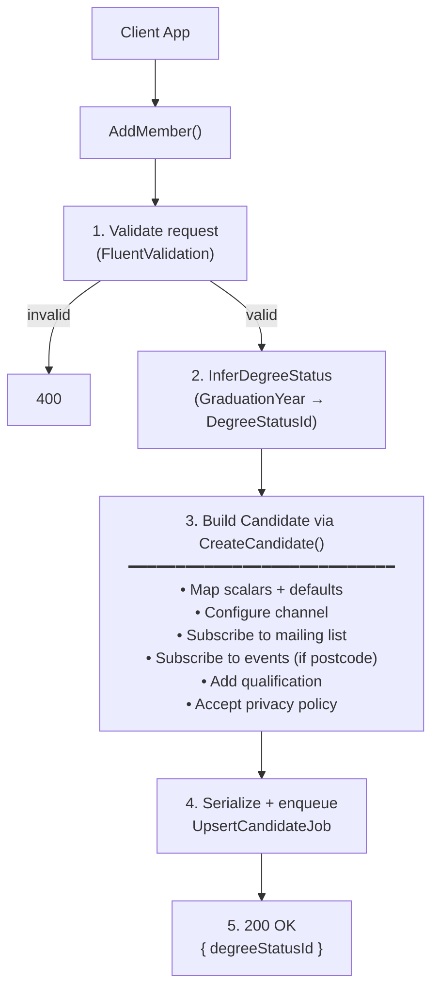

## POST `/api/mailing_list/members`

Please check existing code and swagger doc for reference. I might have made mistakes or missed something here.
https://getintoteachingapi-test.test.teacherservices.cloud/swagger/index.html

**File:** `Controllers/GetIntoTeaching/MailingListController.cs:49`

Adds a candidate to the mailing list (and optionally to events). Validates the request, infers degree status from graduation year, builds a `Candidate` with subscription logic, serializes with change tracking, and enqueues an `UpsertCandidateJob` to persist to CRM. Returns the inferred degree status immediately — CRM upsert is async.

## What it does (step by step)

1. Validates the request (ModelState via FluentValidation) — returns `400` with serialized errors if invalid
2. Infers degree status from `GraduationYear` via `request.InferDegreeStatus(degreeStatusDomainService, currentYearProvider)`:
   - If `GraduationYear` is provided: creates a `DegreeStatusInferenceRequest`, calls the domain service chain to determine `DegreeStatusId`, and sets `InferredGraduationDate` to August 31st of that year
3. Constructs a `Candidate` via `request.Candidate` (calls `CreateCandidate()`):
   - **Maps scalar fields**: candidate ID, consideration journey stage, preferred teaching subject, email, first name, last name, address postcode (formatted via `AsFormattedPostcode`), welcome guide variant, situation, citizenship, visa status, location
   - **Sets scalar defaults**: `EligibilityRulesPassed = "false"`, `PreferredPhoneNumberTypeId = Home`, `PreferredContactMethodId = Any`, `GdprConsentId = Consent`, `OptOutOfGdpr = false`
   - **Configures channel** via `ConfigureChannel()`:
     - Primary: `ChannelId` (Mailing List), `CreationChannelSourceId` (GIT Website), `CreationChannelServiceId` (Mailing List)
     - Additional events channel: only created **if `AddressPostcode` is non-empty** — `CreationChannelSourceId` (GIT Website), `CreationChannelServiceId` (Prospective Events)
     - If `CreationChannelSourceId`, `CreationChannelServiceId`, or `CreationChannelActivityId` are set in the request, they override the defaults
   - **Subscribes to mailing list** via `SubscriptionManager.SubscribeToMailingList()` — always
   - **Subscribes to events** via `SubscriptionManager.SubscribeToEvents()` — only if `AddressPostcode` is non-empty
   - **Adds qualification**: always creates a `CandidateQualification` with `DegreeType = Degree`, `DegreeStatusId`, and `GraduationYear = InferredGraduationDate`
   - **Accepts privacy policy**: if `AcceptedPolicyId` is set, creates a `CandidatePrivacyPolicy` with the accepted policy ID and current timestamp
4. Serializes the constructed candidate with change tracking (`SerializeChangeTracked`)
5. Enqueues `UpsertCandidateJob.Run(json, null)` via Hangfire (async CRM upsert)
6. Returns `200 OK` with `{ "degreeStatusId": <inferred or null> }`

## Request

```json
{
  "candidateId": null,
  "email": "jane.doe@example.com",
  "firstName": "Jane",
  "lastName": "Doe",
  "addressPostcode": "TE5 1IN",
  "considerationJourneyStageId": 222750001,
  "preferredTeachingSubjectId": "3fa85f64-5717-4562-b3fc-2c963f66afa6",
  "acceptedPolicyId": "3fa85f64-5717-4562-b3fc-2c963f66afa6",
  "graduationYear": 2024,
  "degreeStatusId": 222750000,
  "welcomeGuideVariant": "England",
  "situation": null,
  "citizenship": null,
  "visaStatus": null,
  "location": null,
  "channelId": null
}
```

### Field details

| Param | Type | Required | Notes |
|-------|------|----------|-------|
| `email` | `string` | **Yes** | Non-empty |
| `firstName` | `string` | **Yes** | Non-empty |
| `lastName` | `string` | **Yes** | Non-empty |
| `acceptedPolicyId` | `Guid` | **Yes** | |
| `considerationJourneyStageId` | `int` | **Yes** | |
| `preferredTeachingSubjectId` | `Guid` | **Yes** | |
| `addressPostcode` | `string` | No | If provided, triggers additional events subscription and additional events channel creation |
| `graduationYear` | `int` | No | Used to infer `degreeStatusId` and set `inferredGraduationDate` (Aug 31st) |
| `degreeStatusId` | `int` | No | Existing degree status (overridden if graduation year is provided) |
| `welcomeGuideVariant` | `string` | No | |
| `candidateId` | `Guid` | No | Set for existing candidates (exchange access token / magic link) — null for new sign-ups |
| `situation` | `int` | No | Validated against CRM `dfe_situation` picklist |
| `citizenship` | `int` | No | Validated against CRM `dfe_citizenship` picklist |
| `visaStatus` | `int` | No | Validated against CRM `dfe_visastatus` picklist |
| `location` | `int` | No | Validated against CRM `dfe_location` picklist |
| `channelId` | `int` | No | Write-only; overrides the default mailing list channel ID |
| `creationChannelSourceId` | `int` | No | Overrides default GIT Website source |
| `creationChannelServiceId` | `int` | No | Overrides default Mailing List service |
| `creationChannelActivityId` | `int` | No | Overrides default null activity |

## Responses

### `200 OK` — candidate queued for upsert

```json
{
  "degreeStatusId": 222750000
}
```

`degreeStatusId` is the inferred degree status (or null if no `graduationYear` was provided).

### `400 Bad Request` — validation failed This is a new proposed error format

```json
{
    "errors": [
        {
            "error": "BadRequest",
            "message": "Email is not a valid email address"
        }
    ]
}
```

## What happens next (async job)

The `UpsertCandidateJob` runs asynchronously (same job as all other upsert endpoints):

1. **Deduplication**: if a job with the same signature (`candidate.Id + Email + changed properties`) is already queued, the duplicate is silently dropped
2. **CRM pause check**: throws if CRM integration is paused (Hangfire retry will fire)
3. **Upsert**: calls `ICandidateUpserter.Upsert(candidate)` to persist the candidate and all related entities to CRM
4. **Retry & failure**: on repeated failure, after all retries exhausted, sends a failure notification email via GOV.UK Notify (`CandidateRegistrationFailedEmailTemplateId`)

## Flow


