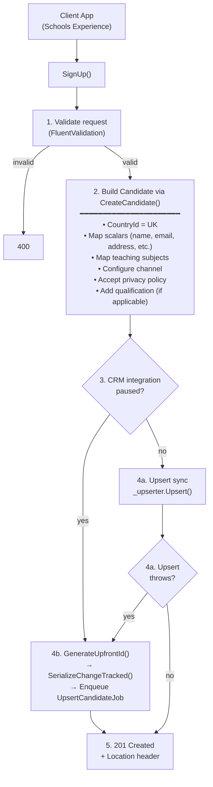

## POST `/api/schools_experience/candidates`

Please check existing code and swagger doc for reference. There might be mistakes or things that I've missed here.
https://getintoteachingapi-test.test.teacherservices.cloud/swagger/index.html

**File:** `Controllers/SchoolsExperience/CandidatesController.cs:44`

Upserts a candidate for the Schools Experience service. Validates the request, builds a `Candidate`, upserts synchronously to CRM (with async fallback), and returns `201 Created` with the `SchoolsExperienceSignUp` response body plus a `Location` header.

## What it does (step by step)

1. **Validates** the request (`ModelState` via FluentValidation `SchoolsExperienceSignUpValidator`) — returns `400` with serialized errors if invalid
2. Injects `IDateTimeProvider` onto the request (for testability)
3. Builds a `Candidate` via `request.Candidate` (calls `CreateCandidate()`):
   - **CountryId** hardcoded to `Country.UnitedKingdomCountryId`
   - **Maps top-level fields**: `Id` (from `CandidateId`), `Email`, `FirstName`, `LastName`, `AddressLine1/2/3`, `AddressCity`, `AddressStateOrProvince`, `AddressPostcode` (runs `.AsFormattedPostcode()`), `AddressTelephone` (from `Telephone`), `HasDbsCertificate`, `DbsCertificateIssuedAt`
   - **Teaching subjects**: maps `PreferredTeachingSubjectId` and `SecondaryPreferredTeachingSubjectId` if non-null
   - **Channel configuration** via `ConfigureChannel(candidateId, primaryContactChannel: this)`:
     - When `DISABLE_DEFAULT_CREATION_CHANNELS=1` and `CreationChannelSourceId` is not provided and candidate is new: sets `ChannelId = DefaultContactCreationChannel` (SchoolsExperience = 222750021)
     - Otherwise: creates `ContactChannelCreation` entries with the primary contact channel defaults; for new candidates, `ChannelId` is set to null
     - Skips channel creation if `CreationChannelSourceId` matches the latest `ContactChannelCreation` on the candidate (deduplication)
   - **Accepts privacy policy**: if `AcceptedPolicyId` is set, creates `CandidatePrivacyPolicy` with `AcceptedPolicyId` and current UTC timestamp
   - **Adds qualification**: if any of `UkDegreeGradeId`/`DegreeStatusId`/`DegreeSubject`/`DegreeTypeId` is provided AND candidate has no existing qualifications, creates a new `CandidateQualification` with `TypeId` defaulting to `Degree`
4. **Upserts candidate** to CRM:
   - If CRM integration is **paused**: calls `candidate.GenerateUpfrontId()` → serializes with change tracking → enqueues `UpsertCandidateJob.Run(json, null)` (async)
   - If CRM is **available**: calls `_upserter.Upsert(candidate)` synchronously
   - If CRM **throws**: falls back to async `QueueUpsert` (same as paused path)
5. Returns `201 Created` with `Location` header pointing to `GET /api/schools_experience/candidates/{id}` and body of `SchoolsExperienceSignUp(candidate)`

## Request

```json
{
  "candidateId": null,
  "preferredTeachingSubjectId": "3fa85f64-5717-4562-b3fc-2c963f66afa6",
  "secondaryPreferredTeachingSubjectId": null,
  "acceptedPolicyId": "3fa85f64-5717-4562-b3fc-2c963f66afa6",
  "email": "jane.doe@example.com",
  "firstName": "Jane",
  "lastName": "Doe",
  "addressLine1": "10 Downing Street",
  "addressLine2": null,
  "addressLine3": null,
  "addressCity": "London",
  "addressStateOrProvince": "London",
  "addressPostcode": "SW1A 1AA",
  "telephone": "07123456789",
  "hasDbsCertificate": true,
  "dbsCertificateIssuedAt": "2024-01-15T00:00:00Z",
  "qualificationId": null,
  "degreeStatusId": null,
  "degreeTypeId": null,
  "degreeSubject": null,
  "ukDegreeGradeId": null,
  "creationChannelSourceId": null,
  "creationChannelServiceId": null,
  "creationChannelActivityId": null
}
```

### Field details

| Param | Type | Required | WriteOnly | Notes |
|-------|------|----------|-----------|-------|
| `preferredTeachingSubjectId` | `Guid` | **Yes** | | |
| `secondaryPreferredTeachingSubjectId` | `Guid` | No | | |
| `acceptedPolicyId` | `Guid` | **Yes** | Yes | Write-only — not returned in response |
| `email` | `string` | **Yes** | | Non-empty |
| `firstName` | `string` | **Yes** | | Non-empty |
| `lastName` | `string` | **Yes** | | Non-empty |
| `addressLine1` | `string` | **Yes** | | Non-null |
| `addressLine2` | `string` | No | | |
| `addressLine3` | `string` | No | | |
| `addressCity` | `string` | **Yes** | | Non-null |
| `addressStateOrProvince` | `string` | **Yes** | | Non-null |
| `addressPostcode` | `string` | **Yes** | | Non-null; formatted via `.AsFormattedPostcode()` |
| `telephone` | `string` | **Yes** | | Non-null; mapped to `Candidate.AddressTelephone` |
| `hasDbsCertificate` | `bool` | **Yes** | | Non-null |
| `dbsCertificateIssuedAt` | `DateTime` | No | | |
| `qualificationId` | `Guid` | No | | Only stored if a qualification is being added |
| `degreeStatusId` | `int` | No | | |
| `degreeTypeId` | `int` | No | | Defaults to `Degree` (222750000) if qualification is created |
| `degreeSubject` | `string` | No | | |
| `ukDegreeGradeId` | `int` | No | | |
| `candidateId` | `Guid` | No | | Set for existing candidates (matchback/exchange) |
| `creationChannelSourceId` | `int` | No | Yes | Overrides default SchoolExperience (222750013) |
| `creationChannelServiceId` | `int` | No | Yes | Overrides default CreatedOnSchoolExperience (222750001) |
| `creationChannelActivityId` | `int` | No | Yes | Overrides default null |

### Response fields (read-only, returned in body)

| Param | Type | Notes |
|-------|------|-------|
| `candidateId` | `Guid` | The candidate's ID |
| `masterId` | `Guid` | Present if merged with another record |
| `merged` | `bool` | Whether the candidate has been merged |
| `fullName` | `string` | Computed full name |
| `email` | `string` | |
| `firstName` | `string` | |
| `lastName` | `string` | |
| `addressLine1` | `string` | |
| `addressLine2` | `string` | |
| `addressLine3` | `string` | |
| `addressCity` | `string` | |
| `addressStateOrProvince` | `string` | |
| `addressPostcode` | `string` | |
| `telephone` | `string` | Fallback: `AddressTelephone` → `Telephone` → `MobileTelephone` → `SecondaryTelephone` (all `.StripExitCode()`) |
| `hasDbsCertificate` | `bool` | |
| `dbsCertificateIssuedAt` | `DateTime` | |
| `preferredTeachingSubjectId` | `Guid` | |
| `secondaryPreferredTeachingSubjectId` | `Guid` | |
| `qualificationId` | `Guid` | From the candidate's latest qualification |
| `degreeStatusId` | `int` | From the candidate's latest qualification |
| `degreeTypeId` | `int` | From the candidate's latest qualification |
| `degreeSubject` | `string` | From the candidate's latest qualification |
| `ukDegreeGradeId` | `int` | From the candidate's latest qualification |
| `defaultContactCreationChannel` | `int` | Always 222750021 (SchoolsExperience) |
| `defaultCreationChannelSourceId` | `int` | Always 222750013 (SchoolExperience) |
| `defaultCreationChannelServiceId` | `int` | Always 222750001 (CreatedOnSchoolExperience) |
| `defaultCreationChannelActivityId` | `int?` | Always null |
| `creationChannelSourceId` | `int` | From the candidate's latest ContactChannelCreation |
| `creationChannelServiceId` | `int` | From the candidate's latest ContactChannelCreation |
| `creationChannelActivityId` | `int` | From the candidate's latest ContactChannelCreation |

## Responses

### `201 Created` — candidate upserted

```json
{
  "candidateId": "3fa85f64-5717-4562-b3fc-2c963f66afa6",
  "preferredTeachingSubjectId": "3fa85f64-5717-4562-b3fc-2c963f66afa6",
  "secondaryPreferredTeachingSubjectId": null,
  "masterId": null,
  "merged": false,
  "fullName": "Jane Doe",
  "email": "jane.doe@example.com",
  "firstName": "Jane",
  "lastName": "Doe",
  "addressLine1": "10 Downing Street",
  "addressLine2": null,
  "addressLine3": null,
  "addressCity": "London",
  "addressStateOrProvince": "London",
  "addressPostcode": "SW1A 1AA",
  "telephone": "07123456789",
  "hasDbsCertificate": true,
  "dbsCertificateIssuedAt": "2024-01-15T00:00:00Z",
  "qualificationId": null,
  "degreeStatusId": null,
  "degreeTypeId": null,
  "degreeSubject": null,
  "ukDegreeGradeId": null,
  "defaultContactCreationChannel": 222750021,
  "defaultCreationChannelSourceId": 222750013,
  "defaultCreationChannelServiceId": 222750001,
  "defaultCreationChannelActivityId": null,
  "creationChannelSourceId": 222750013,
  "creationChannelServiceId": 222750001,
  "creationChannelActivityId": null
}
```

**Headers:**
- `Location`: `/api/schools_experience/candidates/{candidateId}`

### `400 Bad Request` — validation failed

```json
{
    "PreferredTeachingSubjectId": [
        "'Preferred Teaching Subject Id' must not be null."
    ],
    "Email": [
        "'Email' must not be empty."
    ]
}
```

Errors are serialized via ASP.NET Core `SerializableError` — a dictionary of property names to string arrays.

## Channel configuration details

The `ConfigureChannel` call uses the following defaults from `ICreateContactChannel`:

| Property | Default value | Enum |
|----------|--------------|------|
| `DefaultContactCreationChannel` | 222750021 | `Candidate.Channel.SchoolsExperience` |
| `DefaultCreationChannelSourceId` | 222750013 | `ContactChannelCreation.CreationChannelSource.SchoolExperience` |
| `DefaultCreationChannelServiceId` | 222750001 | `ContactChannelCreation.CreationChannelService.CreatedOnSchoolExperience` |
| `DefaultCreationChannelActivityId` | null | — |

These can be overridden by providing `creationChannelSourceId`, `creationChannelServiceId`, or `creationChannelActivityId` in the request.

Channel creation is skipped (deduplicated) when `CreationChannelSourceId` matches the latest `ContactChannelCreation.CreationChannelSourceId` on the candidate record.

## Qualification logic

A `CandidateQualification` is created only if **all** of these conditions are met:
1. At least one of `UkDegreeGradeId`, `DegreeStatusId`, `DegreeSubject`, or `DegreeTypeId` is provided
2. The candidate has no existing qualifications (`candidate.Qualifications.Count == 0`)

When created:
- `TypeId` defaults to `CandidateQualification.DegreeType.Degree` (222750000) if `DegreeTypeId` is null

## Telephone fallback

When populating the response from an existing candidate, telephone is resolved as:

```
AddressTelephone.StripExitCode()
?? Telephone (primary)
?? MobileTelephone
?? SecondaryTelephone
```

## CRM upsert behavior

- **CRM available**: synchronous `_upserter.Upsert(candidate)` — response returned after CRM confirms
- **CRM paused**: async via `QueueUpsert` — generates an upfront GUID, serializes with change tracking, enqueues `UpsertCandidateJob`
- **CRM throws**: same async fallback as paused path
- **Why upfront ID?** The Schools Experience app needs the `CandidateId` immediately, so a GUID is generated client-side rather than waiting for CRM

## Flow



## Rate limiting

| Scope | Endpoint | Period | Limit |
|-------|----------|--------|-------|
| Global | `POST:/api/schools_experience/candidates` | 1m | 60 |
| Schools Experience client | `POST:/api/schools_experience/candidates` | 1m | 250 |
