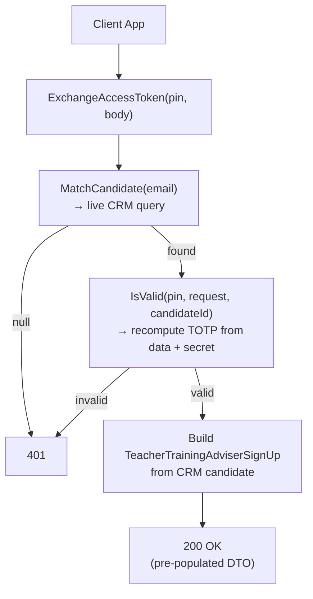

## POST `/api/teacher_training_adviser/candidates/exchange_access_token/{accessToken}`

Please check existing code and swagger doc for reference
https://getintoteachingapi-test.test.teacherservices.cloud/swagger/index.html

Implement `POST /api/candidates/access_tokens` first

**File:** `Controllers/TeacherTrainingAdviser/CandidatesController.cs:101`

Second step of the two-step email verification flow. The user proves they own the email by providing the 6-digit PIN they received from `POST /api/candidates/access_tokens`. If valid, returns their existing CRM data pre-populated into the TTA sign-up form.

## What it does

1. Calls `_crm.MatchCandidate(request)` — live CRM query by email (`Services/CrmService.cs:161`)
2. Calls `_tokenService.IsValid(accessToken, request, candidateId)` — recomputes the TOTP from request data + server `TOTP_SECRET_KEY` and verifies the PIN via OtpNet (`Services/CandidateAccessTokenService.cs:37-60`). Valid for ~15 minutes
3. If candidate not found or PIN invalid → `401 Unauthorized`
4. If valid → returns `new TeacherTrainingAdviserSignUp(candidate)` which calls `PopulateWithCandidate()` — pre-populated from CRM with qualifications, past teaching positions, `canSubscribeToTeacherTrainingAdviser`, etc. (`Models/TeacherTrainingAdviser/TeacherTrainingAdviserSignUp.cs:98` → `CreateCandidate()`)

## Request

```json
{
  "email": "candidate@example.com",
  "firstName": "Jane",
  "lastName": "Doe",
  "dateOfBirth": "1995-06-15",
  "reference": "TTA"
}
```

| Param | Location | Type | Required | Notes |
|-------|----------|------|----------|-------|
| `accessToken` | URL path | `string` | **Yes** | The 6-digit PIN |
| `email` | body | `string` | **Yes** | Must match what was sent to `access_tokens` |
| `firstName` | body | `string` | No | Must match what was sent to `access_tokens` |
| `lastName` | body | `string` | No | Must match what was sent to `access_tokens` |
| `dateOfBirth` | body | `DateTime` | No | Must match what was sent to `access_tokens` |
| `reference` | body | `string` | No | Set from JWT if not provided; not used in TOTP |

The body fields used in TOTP computation (`email`, `firstName`, `lastName`, `dateOfBirth`) must match exactly what was sent to `POST /api/candidates/access_tokens` — if any of them differ, the PIN won't verify. `reference` is excluded from TOTP and doesn't need to match.

## Responses

### `200 OK` — PIN valid

Returns a full `TeacherTrainingAdviserSignUp` JSON with the candidate's existing CRM data.

```json
{
    "candidateId": "3a7e8f9c-...",
    "qualificationId": "b1c2d3e4-...",
    "subjectTaughtId": null,
    "pastTeachingPositionId": null,
    "preferredTeachingSubjectId": null,
    "countryId": "a1b2c3d4-...",
    "degreeCountry": null,
    "typeId": 222750001,
    "ukDegreeGradeId": null,
    "degreeTypeId": null,
    "degreeStatusId": 222750000,
    "initialTeacherTrainingYearId": null,
    "stageTaughtId": null,
    "preferredEducationPhaseId": null,
    "hasGcseMathsAndEnglishId": null,
    "hasGcseScienceId": null,
    "planningToRetakeGcseMathsAndEnglishId": null,
    "planningToRetakeGcseScienceId": null,
    "adviserStatusId": null,
    "email": "jane.doe@example.com",
    "firstName": "Jane",
    "lastName": "Doe",
    "dateOfBirth": "1995-06-15",
    "teacherId": null,
    "degreeSubject": "Physics",
    "addressTelephone": null,
    "addressPostcode": null,
    "graduationYear": 2023,
    "inferredGraduationDate": "2023-08-31",
    "canSubscribeToTeacherTrainingAdviser": false,
    "assignmentStatusId": 222750000
}
```

### `401 Unauthorized` — candidate not found or PIN invalid. New proposed error format

```json
{
    "errors": [
        {
            "error": "Unauthorized",
            "message": "Candidate not found or access token is invalid"
        }
    ]
}
```

The same response is returned for both cases to avoid revealing whether the candidate exists.

## Flow


