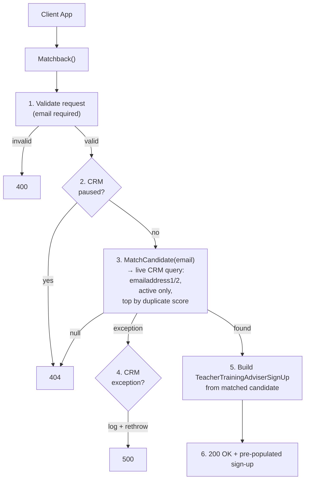

## POST `/api/teacher_training_adviser/candidates/matchback`

Please check existing code and swagger doc for reference
https://getintoteachingapi-test.test.teacherservices.cloud/swagger/index.html

**File:** `Controllers/TeacherTrainingAdviser/CandidatesController.cs:117`

Matches a candidate by email in CRM and returns a pre-populated `TeacherTrainingAdviserSignUp` with their known data (name, DOB, qualifications, past teaching positions, etc.). Unlike `exchange_access_token`, this endpoint requires no PIN — it matches and returns data in a single call.

## What it does (step by step)

1. Sets `request.Reference` to `User.Identity.Name` (JWT client ID) if not already set
2. Validates the request (ModelState) — email is non-empty, valid format, max 100 chars — returns `400` if invalid
3. Checks if CRM integration is paused (Redis-backed flag) — returns `404` if paused (masks candidate existence)
4. Calls `_crm.MatchCandidate(request)` — live CRM query:
   - Generates equivalent email variants (e.g. gmail.com ↔ googlemail.com) via `EmailReconciler`
   - Searches `emailaddress1` and `emailaddress2` for any variant
   - Filters to active (`statecode = Active`) candidates only
   - Orders by `dfe_duplicatescorecalculated` descending, then `modifiedon` descending
   - Takes the top match
   - Loads related data: qualifications, past teaching positions, event registrations
5. If CRM throws an exception — logs `"TeacherTrainingAdviser - CandidatesController - potential duplicate (CRM exception)"` and **re-throws** (no masking)
6. If no candidate found — returns `404`
7. Builds a `TeacherTrainingAdviserSignUp` from the matched candidate (populates `CandidateId`, personal details, latest qualification, latest past teaching position, subscription eligibility, adviser status, etc.)
8. Returns `200 OK` with the pre-populated sign-up

## Request

```json
{
  "email": "candidate@example.com",
  "firstName": "Jane",
  "lastName": "Doe",
  "dateOfBirth": "1995-06-15",
  "reference": "TTA"
}
```

| Param | Type | Required | Notes |
|-------|------|----------|-------|
| `email` | `string` | **Yes** | Validated for format + max 100 chars |
| `firstName` | `string` | No | Used in matchback (may improve CRM match quality) |
| `lastName` | `string` | No | Used in matchback |
| `dateOfBirth` | `DateTime` | No | Used in matchback |
| `reference` | `string` | No | Fallback to JWT client ID if not provided; used for metrics only |

## Responses

### `200 OK` — candidate matched

Returns a pre-populated `TeacherTrainingAdviserSignUp`. Key fields populated from CRM:

```json
{
  "candidateId": "3fa85f64-5717-4562-b3fc-2c963f66afa6",
  "firstName": "Jane",
  "lastName": "Doe",
  "email": "candidate@example.com",
  "dateOfBirth": "1995-06-15",
  "teacherId": "1234567",
  "addressTelephone": "07123456789",
  "addressPostcode": "TE5 1IN",
  "typeId": 222750000,
  "adviserStatusId": null,
  "assignmentStatusId": null,
  "canSubscribeToTeacherTrainingAdviser": true,
  "qualificationId": "3fa85f64-5717-4562-b3fc-2c963f66afa6",
  "degreeSubject": "Mathematics",
  "ukDegreeGradeId": 222750000,
  "degreeTypeId": 222750000,
  "degreeStatusId": 222750000,
  "pastTeachingPositionId": "3fa85f64-5717-4562-b3fc-2c963f66afa6",
  "subjectTaughtId": "3fa85f64-5717-4562-b3fc-2c963f66afa6",
  "preferredTeachingSubjectId": null,
  "countryId": null,
  "initialTeacherTrainingYearId": null,
  "preferredEducationPhaseId": null,
  "hasGcseMathsAndEnglishId": null,
  "hasGcseScienceId": null,
  "planningToRetakeGcseMathsAndEnglishId": null,
  "planningToRetakeGcseScienceId": null
}
```

### `400 Bad Request` — invalid email. This is a new proposed error format

```json
{
    "errors": [
        {
            "error": "BadRequest",
            "message": "Email is not a valid email address"
        }
    ]
}
```

### `404 Not Found` — candidate not found or CRM paused. This is a new proposed error format

```json
{
    "errors": [
        {
            "error": "NotFound",
            "message": "Candidate with #{email} not found"
        }
    ]
}
```

## Flow


## Proposed changes
### Require dateOfBirth param

This endpoint has been flagged as a potential security risk because the only required param is `email`. This makes it easy to get information on candidates.

We propose to make `dateOfBirth` param required along side the `email`.


## Notes

- CRM exceptions are **not** masked (unlike `access_tokens` endpoint) — they log and re-throw as 500
- The returned `TeacherTrainingAdviserSignUp` is the same model used by the `exchange_access_token` and `sign_up` endpoints
- Intended for returning users who already have a CRM record, so the frontend can pre-populate their form


